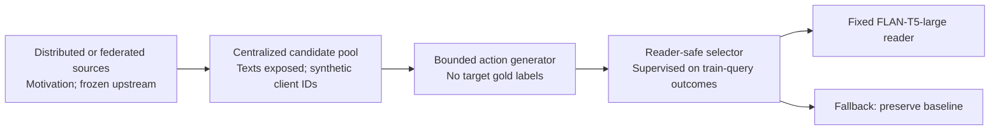
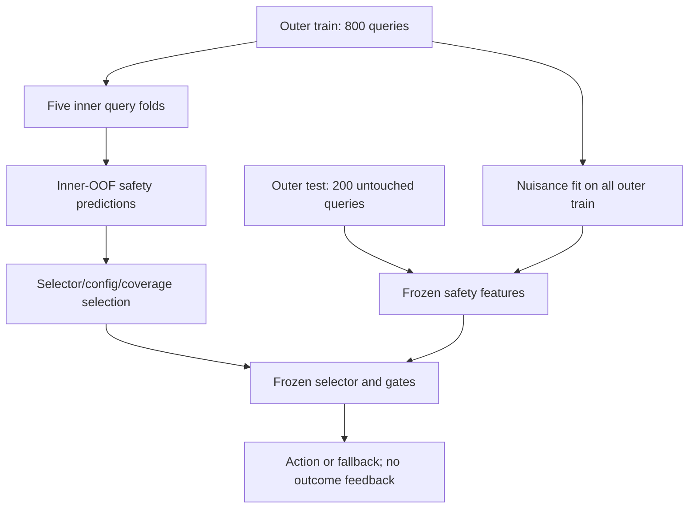

# Submission Figure and Table Plan

## Main manuscript budget

The Findings/COLING version should keep three visual/table units in the main body and move all fold, sensitivity, external diagnostic, and command details to the appendix.

## Figure 1: Scope-aware pipeline

**Purpose:** show where the policy-action-to-reader gap occurs and prevent an end-to-end federated misreading.

Required annotations:

- federated/distributed: upstream motivation only;
- centralized: candidate pool and organizer;
- supervised: action outcomes from outer-train queries;
- unavailable at inference: target answer, target support, target reader outcome, oracle action;
- not evaluated: privacy, communication, natural non-IID clients.

## Figure 2: Fully nested cross-fitting

**Purpose:** make the repaired leakage boundary inspectable.

Caption must state that all five folds have zero train/test overlap and that test outcomes are used only after decisions for final evaluation.

## Table 1: Main fully nested result

Columns: answer access@5, title recall@5, title F1, answer EM, answer F1, answer-title product. Include baseline, selector, delta. Under the table, place the four paired-bootstrap CIs and p-values. Bold only the statistically supported title-level metrics or best means; do not label product as joint F1.

## Table 2: Core ablations

Rows: primary, no nested safety, no support features, inherited weighted utility. Columns: answer delta, title-recall delta, title-F1 delta, product delta, selected answer-drop rate. The key visual comparison is that no-safety and weighted variants obtain evidence gains but negative answer means.

## Figure 3: Main-eligible opportunity ceiling

Use the **main-eligible** action scope:

- 1,000 queries total;
- 797 with no paper-positive eligible action;
- 203 with at least one eligible positive action;
- 59 selected paper-positive actions;
- 29 selected answer drops.

The figure must use a clearly defined priority partition if categories are mutually exclusive. Do not place 59 and 29 directly beside 797 as if all were disjoint without a caption. The all-five-template count of 778 belongs in a small appendix note only.

## Appendix figure: Risk coverage

Use `risk_coverage_figure.pdf`. Caption it “diagnostic sweep with frozen outer-fold models; not used to select the primary 0.5 coverage.” The duplicate realized point near 0.878 reflects eligibility gates at target 0.9/1.0.

## Appendix tables

1. Full outer-fold deltas.
2. Action-template materialization/effectiveness/positive counts.
3. Utility-weight sensitivity ranges and machine-readable reference.
4. Risk-coverage rows with CIs and fallback.
5. 2Wiki and HP-hyper diagnostic boundaries.
6. Environment, reader settings, and artifact checklist.
