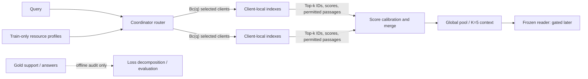

# Data Flow

```mermaid
flowchart LR
  Q["Query"] --> R["Coordinator router"]
  P["Train-only resource profiles"] --> R
  R -->|"Bc(q) selected clients"| C1["Client-local indexes"]
  R -->|"Bc(q) selected clients"| C2["Client-local indexes"]
  C1 -->|"Top-k IDs, scores, permitted passages"| M["Score calibration and merge"]
  C2 -->|"Top-k IDs, scores, permitted passages"| M
  M --> G["Global pool / K=5 context"]
  G --> F["Frozen reader: gated later"]
  A["Gold support / answers"] -. "offline audit only" .-> O["Loss decomposition / evaluation"]
```
