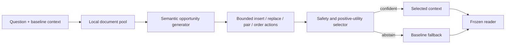
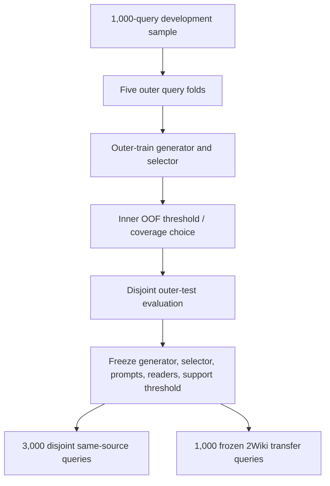

# Generating Reader-Compatible Context Actions for Multi-Hop Question Answering

## Abstract

Context selectors cannot improve a multi-hop question when their candidate set contains no reader-compatible intervention. In a motivating study, nearly doubling a hand-written action table raises positive-query opportunity only from 20.3% to 23.4% while leaving positive-action density unchanged. We address this candidate-opportunity gap with a semantic generator that constructs bounded, anchor-preserving context actions, followed by fully nested reader-safe selection. The generator increases positive-query opportunity from 23.4% to 29.2%. On a 1,000-query development protocol, official answer F1 improves by 0.0133 (p=0.0176) and supporting-fact F1 by 0.0053 (p=0.0372), while joint F1 shows a positive, non-significant trend (+0.0064, p=0.0752). After freezing the generator, selector, thresholds, readers, prompts, and support predictor, we evaluate 3,000 disjoint same-source HotpotQA queries. Answer, supporting-fact, and joint F1 improve by 0.0088, 0.0056, and 0.0064, respectively; the joint result has p=0.0004. The same selected contexts improve answer and joint metrics for FLAN-T5-Large and UnifiedQA-T5-Large, although their support predictor is shared. Frozen transfer to 2WikiMultiHopQA yields positive answer and joint point estimates but no statistically reliable gain. These results show that generating reader-compatible opportunities before selective intervention yields small but reproducible multi-hop QA gains, while external transfer and safety calibration remain open.

## 1. Introduction

Multi-hop question answering requires a reader to combine evidence distributed across passages [@yang-etal-2018-hotpotqa; @ho-etal-2020-2wiki]. Retrieval is necessary, but the final context must do more than contain individually relevant documents. It must preserve the passage that resolves the answer, expose complementary hops, avoid redundant distractors, and present evidence in an order the reader can use. A context change can therefore improve retrieval-side support while leaving the answer unchanged or even making it worse.

We call this mismatch the **policy-action-to-reader gap**: an upstream evidence action does not automatically become a downstream reader gain. Recent work aligns passage selection with reader needs, selects sets instead of independently ranked documents, or compresses retrieved context [@xin-etal-2025-rcps; @lee-etal-2025-setr; @xu-etal-2024-recomp]. These approaches motivate reader-aware context construction, but they also raise a prior question: does the selector receive any useful alternative for this query?

This prior question defines the **candidate-opportunity gap**. A selector can choose only among actions that its generator exposes. If every candidate either misses the second hop or damages an answer-bearing anchor, a better selector cannot improve that query. Selection accuracy and candidate opportunity should therefore be measured separately. Otherwise, failures caused by an impoverished action set are incorrectly attributed to the selection model.

A controlled motivating study demonstrates this distinction. An initial fixed-action table contains 4,000 effective alternatives and exposes at least one answer-safe positive action for 20.3% of 1,000 HotpotQA development queries. Expanding hand-written templates to 7,882 actions raises query coverage only to 23.4%, while positive-action density changes from 9.48% to 9.43%. More templates create more rows without reliably changing which queries can be helped. This negative result motivates semantic, query-conditioned opportunity generation rather than another selector over the same table.

We propose a two-stage method. A semantic opportunity generator predicts missing reasoning structure, scores document opportunity, models whether pairs form complementary hops, and constructs at most eight bounded actions. Actions insert or replace evidence, form two-document chains, remove redundancy, or apply restricted order changes while retaining answer-anchor proxies. A reader-safe selector then predicts whether an action preserves answer quality and provides positive answer-evidence utility. It acts only within a risk-controlled coverage budget and otherwise returns the original context.

The development protocol is fully nested by query. In each of five outer folds, generator and selector models are trained on 800 queries and applied to 200 disjoint queries. Inner out-of-fold predictions choose selector thresholds and coverage. Target-query answers, supporting facts, reader outcomes, and oracle action labels are excluded from generation and test-time selection. Reader outcomes are allowed only as supervision for training queries. This design separates legitimate reader-aware training from target-query leakage.

The semantic generator raises positive-query opportunity from 23.4% to 29.2% and positive-action density from 9.43% to 14.71%. On the 1,000-query development protocol, official answer and supporting-fact F1 improve significantly, while joint F1 has a positive, non-significant change. The central empirical anchor is a subsequent 3,000-query same-source holdout evaluated after freezing the full pipeline. FLAN-T5-Large gains 0.0088 answer F1, 0.0056 supporting-fact F1, and 0.0064 joint F1; all three paired tests are significant. UnifiedQA-T5-Large shows the same answer and joint direction on identical contexts.

The evidence remains deliberately bounded. Opportunity passes three of five pre-specified criteria, so the candidate gap is narrowed rather than solved. The 3,000 queries are disjoint but come from the same HotpotQA source. On 2WikiMultiHopQA, frozen transfer retains positive answer and joint point estimates, but supporting-fact F1 is flat and all confidence intervals include zero. The second reader shares the support predictor. Our contribution is therefore not universal context selection or evidence of dataset-independent reliability. It is evidence that semantic opportunity generation, coupled with fully nested reader-safe selection, produces small but statistically reliable official multi-hop QA gains on a frozen same-source holdout.

Our contributions are fourfold:

1. We identify the candidate-opportunity gap in reader-side context intervention.
2. We introduce bounded semantic action generation based on document opportunity and pair complementarity.
3. We combine generation with risk-controlled selection under fully nested query-level cross-fitting.
4. We demonstrate significant development answer/support gains and frozen same-source answer/support/joint gains, with answer and joint directions consistent across two readers.

**Figure 1: Candidate-opportunity gap and method overview.**

## 2. Related Work

### Multi-Hop Retrieval

Multi-hop retrievers search a corpus iteratively so later retrieval can depend on earlier evidence [@xiong-etal-2021-mdr]. HotpotQA, 2WikiMultiHopQA, and MuSiQue make compositional evidence observable through support annotations or controlled reasoning structures [@yang-etal-2018-hotpotqa; @ho-etal-2020-2wiki; @trivedi-etal-2022-musique]. Our method does not replace corpus retrieval. It starts from a fixed local document pool and studies the reader-facing context formed from that pool.

### Reader-Aware and Set Selection

Reader-Centered Passage Selection aligns passage choice with downstream reader needs [@xin-etal-2025-rcps]. SetR models retrieval augmentation as set selection rather than independent ranking [@lee-etal-2025-setr], and RankRAG integrates ranking with generation [@yu-etal-2024-rankrag]. These methods select from an available pool. Unlike evaluations that begin after fixing the candidate set, we explicitly measure and optimize query-level intervention opportunity, separating candidate-generation failure from reader-safe selection failure. We do not claim that prior work ignores candidate construction; our novelty is the explicit opportunity decomposition and its fully nested evaluation.

### Compression and Context Risk

RECOMP learns extractive and abstractive compression for retrieval-augmented language models [@xu-etal-2024-recomp]. Context position and irrelevant text can change model behavior even when relevant evidence is present [@liu-etal-2024-lost; @shi-etal-2023-distracted]. Our bounded actions retain document text but may insert, replace, pair, or reorder evidence. Risk-controlled fallback follows the selective-prediction principle of intervening only when confidence is sufficient [@geifman-elyaniv-2019-selectivenet].

## 3. Problem Setting

Given a query q, baseline context C0, and frozen reader R, a generator exposes a bounded action set A(q). An action is development-positive when it preserves answer F1 and improves the product of answer F1 and title-level evidence F1, with either improved title recall or non-decreasing title F1. A query has **opportunity** if at least one effective action is positive. This diagnostic definition uses reader outcomes only on training or held-out development actions; inference never observes the target answer, support facts, or outcomes.

The action set contains single complementary insertion, anchor-preserving replacement, two-document chain, redundancy replacement, bridge-first reorder, and answer-anchor-first reorder. Every action preserves an at-most-five-document reader budget and source text. Fallback returns C0.

## 4. Semantic Opportunity Generation

The generator represents a query's missing evidence state, document-level opportunity, and pair complementarity. Document features combine lexical signals, MPNet similarity [@song-etal-2020-mpnet], cross-encoder relevance, novelty, and relation to the current context. Pair features estimate whether two documents supply complementary hops. A deterministic constructor converts scores into at most eight bounded actions while protecting inference-time answer-anchor proxies.

The no-leak audit covers 1000 outer-test queries and 7,934 effective actions. Each fold trains on 800 queries and produces actions for 200 disjoint queries. Target-query answer, gold support, reader outcome, oracle action, and post-hoc coverage are absent. The final generator exposes 5,655 contexts not present in the heuristic table.

## 5. Reader-Safe Selection

Two logistic heads predict answer safety and positive utility from inference-safe action features. For each outer fold, five inner query splits produce out-of-fold predictions on the 800 outer-training queries. Inner data choose safety threshold, positive threshold, and intervention coverage between 10% and 30%, subject to a 5% selected-action answer-drop budget and a mean answer-loss tolerance of 0.001. The selector chooses the highest-scoring eligible action within the budget; otherwise it returns the baseline. Aggregate development coverage is 0.260 with a 5.0% selected answer-drop rate.

## 6. Experimental Setup

### Data and Protocol

The development evaluation uses 1,000 HotpotQA distractor-validation queries [@yang-etal-2018-hotpotqa] under five fully nested query folds. A second sample contains 3,000 disjoint queries from the same source ordering. All generator models, selector models, thresholds, coverage rules, reader prompts, decoding, and the support threshold are frozen before this second evaluation. We call it a **frozen same-source holdout confirmation**, not external validation.

External transfer uses 1,000 deterministically hash-sampled 2WikiMultiHopQA development queries [@ho-etal-2020-2wiki]. Only the data adapter changes; no target-dataset training or tuning is performed.

### Readers and Metrics

FLAN-T5-Large is the primary answer reader [@raffel-etal-2020-t5]. UnifiedQA-T5-Large receives identical selected contexts [@khashabi-etal-2020-unifiedqa]. A single sentence-support predictor with threshold 0.7 is frozen across both readers and datasets. Official metrics are answer, supporting-fact (SP), and joint EM/F1. Title-level evidence measures are development diagnostics only.

### Baselines and Statistics

The baseline is a frozen dense-sparse hybrid retriever with uniform document weights and Top-5 output; it is not replaced by a BM25-only baseline [@robertson-zaragoza-2009-bm25]. We also run the official RECOMP extractive checkpoint on the same Top-5 documents [@xu-etal-2024-recomp]. RECOMP emits one sentence and uses the frozen FLAN reader rather than its paper's FLAN-UL2 reader, so it is an **official-code reproduction under a standardized reader adaptation**.

All metric comparisons are paired by query, with 5,000 bootstrap resamples. Development results are model-development evidence. The 3,000-query FLAN joint result is the headline holdout metric, but no immutable pre-run hierarchy was found; we therefore do not claim formal ordered testing or familywise confirmatory control. UnifiedQA, 2Wiki, and RECOMP are supporting analyses.

**Figure 2: Development and frozen-holdout protocol.**

## 7. Results

### Opportunity

**Figure 3: Opportunity across motivating and proposed generators.**

| Generator study | Positive-action density | Positive-query coverage |
| --- | ---: | ---: |
| Initial fixed actions | 9.48% | 20.3% |
| Heuristic expansion | 9.43% | 23.4% |
| Semantic opportunity generation | 14.71% | 29.2% |

Semantic generation raises positive density by 5.28 points and query coverage by 5.8 points over heuristic expansion. Non-ceiling coverage reaches 47.63%. It passes conditional coverage, marginal breadth, and density criteria, but misses the 30% overall-coverage criterion and the new-query-efficiency criterion. The candidate-opportunity gap is reduced, not solved.

### Development Behavior

**Table 1: Official 1,000-query development results.**

| System | Answer EM | Answer F1 | SP EM | SP F1 | Joint EM | Joint F1 |
| --- | ---: | ---: | ---: | ---: | ---: | ---: |
| Frozen Top-5 baseline | 0.483 | 0.6114 | 0.073 | 0.4920 | 0.052 | 0.3241 |
| Semantic generation + reader-safe selection | 0.493 | 0.6247 | 0.074 | 0.4973 | 0.051 | 0.3305 |
| Delta | +0.0100 | +0.0133 | +0.0010 | +0.0053 | -0.0010 | +0.0064 |

Paired bootstrap: answer F1 [+0.0024, +0.0249], p=0.0176; SP F1 [+0.0003, +0.0106], p=0.0372; joint F1 [-0.0005, +0.0132], p=0.0752. Joint F1 is positive but non-significant.

The selector intervenes on 260 of 1,000 queries. Answer and SP F1 improve significantly at the unadjusted 0.05 level. Joint F1 rises by 0.0064, but its interval includes zero. This establishes method behavior under fully nested model development; it is not the paper's strongest joint evidence.

### Frozen Same-Source Holdout Confirmation

**Table 2: Frozen 3,000-query same-source holdout.**

| Reader | Coverage | Answer F1 delta | SP F1 delta | Joint F1 delta | Joint 95% CI | Joint p |
| --- | ---: | ---: | ---: | ---: | ---: | ---: |
| FLAN-T5-Large | 0.258 | +0.0088 | +0.0056 | +0.0064 | [+0.0027, +0.0104] | 0.0004 |
| UnifiedQA-T5-Large* | 0.258 | +0.0110 | +0.0056 | +0.0085 | [+0.0049, +0.0122] | <0.0002 |

*The sentence-support predictor is shared and frozen rather than independently trained for UnifiedQA. The second row is an answer-reader directional replication, not an independent support-pipeline replication.

With no further tuning, FLAN answer F1 rises from 0.6183 to 0.6271 (delta +0.0088, p=0.0096), SP F1 from 0.4930 to 0.4987 (delta +0.0056, p=0.0004), and joint F1 from 0.3292 to 0.3356 (delta +0.0064, p=0.0004). The selected answer-drop rate is 2.0%. UnifiedQA answer and joint F1 improve by 0.0110 and 0.0085. The support predictor is shared, so the second reader confirms answer/joint direction rather than independent support robustness.

## 8. Analysis

### Generator Components

**Table 3: Core generator ablations on fully nested development actions.**

| Generator | Positive density | Query coverage | Non-ceiling coverage | Answer-safe rate |
| --- | ---: | ---: | ---: | ---: |
| Full semantic generator | 14.71% | 29.2% | 47.63% | 92.66% |
| - pair complementarity | 10.27% | 27.7% | 45.17% | 93.07% |
| - two-document chains | 10.40% | 25.1% | 40.92% | 93.69% |
| - document opportunity model | 14.91% | 32.6% | 53.19% | 91.74% |
| Lexical-only generator | 13.87% | 30.7% | 50.25% | 92.59% |

Pair complementarity provides the clearest learned-component contribution, and two-document chains provide the clearest structural contribution. Removing the document opportunity model increases raw breadth but lowers answer safety, revealing a breadth-risk trade-off. Other feature removals are mixed and are reported in the appendix.

Removing pair complementarity reduces positive density from 14.71% to 10.27%, the largest learned-component loss. Removing two-document chains reduces query coverage from 29.2% to 25.1% and non-ceiling coverage from 47.63% to 40.92%, the largest structural loss. The document opportunity model has a different role: without it, coverage rises to 32.6%, but answer safety falls from 92.66% to 91.74%. It therefore trades raw breadth for risk rather than monotonically increasing opportunity. MPNet, cross-encoder, missing-hop, and redundancy ablations are mixed and appear only in the appendix.

### Opportunity, Selection, and Risk

The generator exposes a positive action for 292 development queries, while the selector changes 260 contexts using inference-safe predictions. Opportunity is an empirical upper bound, not a promise that the selector will identify every positive action. This decomposition explains why a 5.8-point opportunity increase produces smaller downstream metric changes. Risk also shifts across samples: selected answer drops are 5.0% in development, 2.0% on the same-source holdout, and 6.92% on 2Wiki.

### Controlled RECOMP Comparison

RECOMP and our method receive the same baseline Top-5 documents, but their reader-facing budgets differ sharply. The baseline and selected document contexts average 668.2 and 660.6 FLAN tokens; RECOMP's single extracted sentence averages 47.1, a 7.35% ratio. One sentence is structurally unlikely to represent two disjoint supporting facts. Under the standardized FLAN reader and evaluated Top-1 setting, RECOMP is poorly matched to the multi-hop context budget. The comparison tests setting compatibility, not universal superiority, and detailed scores are relegated to the appendix.

## 9. External Transfer and Generalization Boundary

**Table 4: Supporting comparisons.**

| Evaluation | Answer F1 delta | SP F1 delta | Joint F1 delta | Interpretation |
| --- | ---: | ---: | ---: | --- |
| Frozen 2Wiki transfer | +0.0086 | -0.0006 | +0.0033 | All relevant CIs include zero |
| Official-code RECOMP Top-1 vs baseline* | -0.1678 | -0.1219 | -0.1157 | Standardized reader; unmatched output budget |

*RECOMP receives the same Top-5 documents but emits one sentence averaging 47.1 context tokens, versus 668.2 for the baseline. Detailed results are in the appendix and do not support a general superiority claim.

On 2Wiki, answer F1 changes by +0.0086 ([-0.0021, +0.0191], p=0.1116), SP F1 by -0.0006 ([-0.0036, +0.0025], p=0.6928), and joint F1 by +0.0033 ([-0.0031, +0.0098], p=0.3296). The frozen pipeline preserves positive answer and joint point estimates, but all confidence intervals include zero. This rules out neither no effect nor a small negative effect and does not establish statistically reliable transfer. The selected answer-drop rate increases to 6.92%, identifying safety calibration as the main distribution-shift boundary.

## 10. Limitations

1. **Opportunity remains incomplete.** The generator passes three of five pre-specified criteria. Overall positive-query coverage is 29.2%, and new-query efficiency remains below the motivating heuristic study.
2. **The strongest holdout is same-source.** The 3,000 queries are disjoint from development and evaluated with a frozen pipeline, but they come from the same HotpotQA source and are not external generalization evidence.
3. **External transfer is non-significant.** On 2WikiMultiHopQA, answer and joint point estimates are positive, supporting-fact F1 is flat, and all relevant confidence intervals include zero. The higher selected answer-drop rate indicates a calibration boundary.
4. **Support replication is not independent.** UnifiedQA receives the same selected contexts and shares the sentence-support predictor used with FLAN. The result supports answer-reader direction but does not independently replicate support prediction.
5. **Generator component evidence is mixed.** Pair complementarity and two-document chains have clear opportunity contributions. Other semantic features are non-monotonic and remain parts of a frozen recipe rather than independently necessary innovations.
6. **The RECOMP comparison has an unmatched output budget.** It uses official code and checkpoint with the same Top-5 input, but emits one sentence under a standardized reader adaptation. The comparison measures compatibility with this setting, not general superiority.

## 11. Conclusion

A selector cannot recover a reader-compatible action that its generator never exposes. Semantic opportunity generation increases this action space, and fully nested reader-safe selection converts a conservative subset into small but reproducible gains on a frozen same-source holdout. External transfer and safety calibration remain open.
