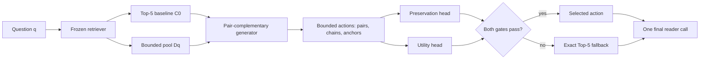

# Opportunity-Aware Context Construction with Answer-Preserving Selection for Multi-Hop QA

A multi-hop reader needs complementary evidence without losing passages that express the answer, yet a selector can only choose among contexts exposed by its generator. We study this candidate-opportunity gap in a frozen approximately Top-10 post-retrieval pool. Full scores pair complementarity, forms bounded two-document chains, preserves baseline anchors, and uses fully nested preservation and utility heads to apply one action or return the Top-5 baseline exactly. On disjoint frozen HotpotQA holdouts of 3,000 and 3,405 queries, Full changes Answer/SP/Joint F1 by +0.0088/+0.0056/+0.0064 and +0.0116/+0.0061/+0.0080 at 25.8%-25.9% coverage. An outcome-aware diagnostic restricted to the same frozen actions places answer-preserving oracle Joint F1 at 0.4397 and 0.4251, versus policy values 0.3356 and 0.3280; this retrospective result measures opportunity and selector regret, not deployable performance. A post-hoc secondary `ce_score_order` baseline under the same pool, five-document budget, reader, and support predictor reaches Joint F1 0.3420/0.3405, compared with Full 0.3356/0.3280, but its Answer F1 is lower than Full by 0.0193/0.0181. Full costs 213.48 versus 140.88 ms/query, and frozen 2Wiki transfer remains non-significant with no reasoning-type effect surviving FDR correction. The evidence supports a bounded quality-risk-cost trade-off and clarifies that strong independent relevance recovers much of the SP/Joint benefit; it does not establish universal reranking superiority or cross-domain robustness.

## 1. Introduction

Multi-hop question answering requires more than collecting individually relevant passages. A reader must see complementary evidence together, within a fixed budget and in a usable order. One passage may establish an entity relation while another supplies the answer-bearing fact. Adding the former can improve evidence coverage yet delete or demote the latter. The object being optimized is therefore a reader context, not a bag of independent relevance scores.

This observation exposes a limitation of learned selection. A selector can choose only among actions proposed for a query. If every proposal omits one hop, removes an answer anchor, or preserves the same deficient ordering, a more accurate selector still cannot repair the context. We call the difference between available actions and useful reader-compatible actions the **candidate-opportunity gap**. Opportunity precedes policy quality: an unavailable repair has zero probability of being selected.

Independent reranking does not directly model this gap. Two passages can have moderate isolated relevance but high joint value because they cover different hops. Conversely, template expansion can produce many insertions and replacements that are redundant or destructive. Increasing action count alone therefore need not increase the density of actions that improve downstream utility while preserving answer quality.

We address the gap with pair-complementary context construction. Starting from a frozen Top-5 baseline and an approximately ten-document pool, the generator estimates document opportunity, scores whether pairs provide complementary evidence roles, and builds bounded two-document chains. It preserves strong early baseline anchors whenever the context budget permits. The method rearranges supplied passages; it does not alter the corpus retriever, synthesize evidence, or search an unrestricted permutation space.

A separate policy predicts answer preservation and positive reader utility. An action is eligible only when both frozen thresholds pass and the fold-level coverage budget permits intervention. Otherwise, the system returns the original Top-5 context exactly. The final answer reader runs once. We call this risk-controlled selection because the gate is trained and calibrated to limit empirical intervention risk; the term does not imply a per-query safety guarantee.

Evaluation of such a decision system is vulnerable to leakage if action outcomes, thresholds, and test queries are mixed. We use five outer folds: generator and selector models fit outer-training queries, inner out-of-fold predictions set thresholds and coverage, and outer-test outcomes remain unseen. The complete pipeline is then frozen before evaluation on two disjoint same-source HotpotQA holdouts of 3,000 and 3,405 queries.

Both holdouts show modest positive population changes. Answer/SP/Joint F1 increase by +0.0088/+0.0056/+0.0064 and +0.0116/+0.0061/+0.0080 at 25.8%-25.9% coverage. The selected subset has larger descriptive means, but most interventions tie and 7.75%-7.83% reduce Answer F1. Full also raises measured post-retrieval latency from 140.88 to 213.48 ms/query. These results support a same-source quality-risk-cost trade-off, not broad safety, efficiency, or transfer claims.

Our contributions are fourfold. First, we formulate candidate opportunity as a necessary precondition for reader-aware selection. Second, we introduce pair-complementary, anchor-preserving bounded actions with exact fallback. Third, a fully nested study separates population gain, intervention risk, and cost across two frozen holdouts. Fourth, post-hoc diagnostics quantify frozen-action oracle regret, compare a protocol-matched independent CrossEncoder reranker, and test whether 2Wiki failure follows official reasoning types. The added analyses narrow rather than enlarge the claim: pair-aware Full is an answer-preserving selective trade-off point, not a universal replacement for relevance reranking.

**Figure 1: Candidate opportunity and the selective context-construction pipeline.**

The selector can choose only from generated actions; if no action contains a reader-compatible repair, selection cannot recover it. No answer, support annotation, or candidate reader outcome is used at test time.

## 2. Related Work

**Multi-hop retrieval and QA.** HotpotQA and 2WikiMultiHopQA pair answers with supporting facts, making it possible to distinguish answer generation from evidence access [@yang-etal-2018-hotpotqa; @ho-etal-2020-2wiki]. Multi-step retrievers such as MDR acquire evidence across retrieval steps [@xiong-etal-2021-mdr]. Our setting starts later: a frozen retriever has already produced a bounded candidate pool, and the method reorganizes that pool for a fixed reader.

**Reader-aware context construction.** Reader-aware retrieval and reranking account for downstream behavior beyond independent query-document relevance [@yu-etal-2024-rankrag; @xin-etal-2025-rcps; @lee-etal-2025-setr]. Prior analyses show that distractors and evidence position can alter reader output [@shi-etal-2023-distracted; @liu-etal-2024-lost]. We distinguish action opportunity from action selection: a risk-controlled selector remains limited by the combinations exposed by its generator.

**Compression and selective prediction.** RECOMP learns extractive context compression [@xu-etal-2024-recomp]. Because its released Hotpot configuration and our near-full contexts have different budgets and objectives, we use the author-released compressor under a common FLAN reader and include a 660-token condition plus a source-order truncation control. Selective prediction motivates fallback when estimated risk is high [@geifman-elyaniv-2019-selectivenet]. Here fallback means preserving the frozen retrieval baseline, and offline reader outcomes supervise the gate without adding online candidate-reader calls.

The closest systems differ along two axes: what actions they expose and how they decide whether to use them. Multi-step retrieval changes which documents enter the pool; RankRAG-like models improve ranking for generation; SetR/RCPS-style methods choose passage sets; RECOMP constructs compressed sentence contexts. Our method holds the retriever fixed and asks whether the bounded pool contains a context action that jointly preserves answer expression and improves reader utility. We do not claim that earlier work never creates candidates. The contribution is to make action availability explicit, generate complementary pair actions, and evaluate opportunity separately from selective intervention risk.

## 3. Problem and Method

### 3.1 Problem and Opportunity

For a question $q$, a frozen retriever returns a bounded document pool $D_q$ and ordered Top-5 baseline $C_0(q)$. A context action maps $C_0$ to another five-document sequence using only documents in $D_q$ and without editing source text. The generator exposes a finite action set $A(q)$; the selector either chooses one action or returns $C_0$.

During training only, an action receives an answer-preservation label when the frozen reader's Answer F1 is no lower than on $C_0$, and a positive-utility label when it improves the reader-side joint answer-evidence utility. Query opportunity is the existence of at least one action satisfying both labels in $A(q)$. It is an empirical upper bound for any selector restricted to that set, not an inference-time label or guarantee.

### 3.2 Full Pair-Complementary Action Generator

#### 3.2.1 Candidate document signals

The Full generator computes normalized BM25, question-title and question-text overlap, named-entity overlap, bridge overlap with baseline documents, novelty, and redundancy. It augments these lexical signals with cached MPNet query-document similarities [@song-etal-2020-mpnet] and cross-encoder relevance. At test time these features use only the question, candidate text, baseline ordering, and learned parameters; answers, support annotations, and reader outcomes are absent.

#### 3.2.2 Missing-hop and document-opportunity modules

A missing-hop estimator summarizes which query and baseline signals remain weakly represented. A document-opportunity model then scores whether a candidate can fill that estimated gap while adding nonredundant information. Both models are trained inside each outer fold from training-query outcomes. They are components of the empirically stronger Full implementation, not independently established monotonic contributions.

#### 3.2.3 Pair complementarity

Individual relevance cannot determine whether two documents jointly supply different hops. For each pair among the top candidate set, the generator constructs features from their individual scores, entity-chain overlap, combined novelty, redundancy, and relation to the missing-hop state. A balanced pair classifier estimates complementarity. With at most $L$ candidate documents, pair scoring is bounded by $L(L-1)/2$; the frozen deployment uses ten pair scores per query.

#### 3.2.4 Bounded two-document chain construction

High-scoring complementary pairs form bounded two-document actions. The pair is inserted into weak tail positions of the five-document baseline, producing a compact chain rather than an unconstrained search over permutations. The generator also retains a small single-complementary-insertion family. Duplicate contexts are removed, and the candidate action count is capped before selection.

#### 3.2.5 Anchor preservation and action pruning

The constructor protects the strongest early baseline anchors whenever the budget permits. This prevents an apparently useful support insertion from deleting the passage that supplies answer wording. Actions that duplicate a context, violate the five-document budget, or rank below the frozen pruning rule are discarded. Fallback is always present.

### 3.3 Risk-Controlled Selector

The selector has two balanced logistic heads. The preservation head estimates whether an action retains baseline answer quality; the utility head estimates whether it yields a positive reader-side change. Inner out-of-fold predictions determine both thresholds and a 10-30% coverage budget. On an outer-test query, an action is eligible only if it passes both heads. The highest-ranked eligible action is applied while the fold-level budget remains; all other queries receive the exact baseline. The reader then evaluates one final context. These estimates control average intervention risk but do not certify individual actions.

### 3.4 Training supervision and inference contract

Candidate outcomes are produced offline by replaying the frozen reader on actions generated from outer-training queries. An action is labeled preserved when its Answer F1 is no lower than the corresponding baseline and positive when its joint answer-evidence utility increases. These labels supervise document, pair, preservation, and utility models; they are never features. At inference, the contract is limited to the question, candidate passages, baseline order, lexical/entity/semantic scores, and learned parameters. The system does not inspect gold answers, supporting facts, or candidate reader predictions, and it does not call the reader to search among actions.

This distinction matters for both validity and cost. The policy is reader-aware because reader outcomes define training targets, but deployment is not an expensive per-candidate reader loop. The chosen or fallback context is serialized once and passed to the same frozen answer reader used by baseline.

## 4. Fully Nested Protocol

### 4.1 Fully Nested Training and Evaluation

Five outer folds separate training from evaluation. Generator modules and selector heads fit only outer-training queries. Inner folds tune thresholds and coverage without reading outer-test outcomes. Each outer-test query is processed by fold-specific frozen models. The 3,000-query and 3,405-query holdouts are disjoint from the 1,000 development queries, and no holdout outcome selects an architecture or threshold.

### 4.2 Experimental setup

We use HotpotQA distractor validation [@yang-etal-2018-hotpotqa]. A fixed 1,000-query development slice supports nested training and threshold selection. The next disjoint 3,000 queries form the original confirmatory holdout; the remaining 3,405 form an untouched revision holdout. All retain the same source distribution and are not external-domain tests.

The frozen upstream baseline is HybridSoftRetriever with alpha 0.55, uniform document weights, and Top-5 output. FLAN-T5-Large is the primary answer reader [@raffel-etal-2020-t5], using greedy decoding, at most 32 generated tokens, a 1,024-token input limit, and context capped at 3,200 characters. A Hotpot-development support predictor uses a frozen 0.7 threshold. We report official Answer, supporting-fact (SP), and Joint EM/F1. Paired 95% intervals and two-sided p-values use 5,000 query-level bootstrap resamples.

For RECOMP, the author-released HotpotQA compressor scores sentences in the same Top-5 input [@xu-etal-2024-recomp]. Development budgets are 64, 128, 256, 384, 512, and 660 FLAN tokens; 660 is frozen before holdout evaluation. Baseline-Truncated retains source sentence order at the same budget. All systems share reader, prompt, support predictor, and metric code.

For online cost, all systems run on one GPU with batch size one over the same ordered queries. We use 50 warmup queries and measure the next 500, synchronizing CUDA around every component. Model loading is excluded. Online features/actions are recomputed and their final context must exactly match the frozen artifact. Candidate outcome labeling and training are offline.

The confirmatory samples are constructed from a fixed ordering and audited for query-ID overlap. The original 3,000-query holdout is opened only after the nested development pipeline is frozen. The remaining 3,405 queries are untouched while the Lite architecture and 0.002 non-inferiority margin are fixed. Statistical intervals and p-values are query-level paired bootstrap estimates, so every comparison preserves the baseline/action pairing for the same question. The second sample is not used to retune Full after the first result.

## 5. Main Results

### 5.1 Two frozen same-source holdouts

| Frozen split | N | Coverage | Answer delta | SP delta | Joint delta | Answer-drop | Joint-drop |
|---|---:|---:|---:|---:|---:|---:|---:|
| Original holdout | 3,000 | 25.8% | +0.0088 | +0.0056 | +0.0064 | 7.75% | 14.86% |
| Untouched second holdout | 3,405 | 25.9% | +0.0116 | +0.0061 | +0.0080 | 7.83% | 14.19% |

Full improves Answer, SP, and Joint F1 on both frozen holdouts. On the original holdout, the paired 95% intervals are [+0.0023,+0.0152], [+0.0031,+0.0083], and [+0.0027,+0.0104]; on the untouched second holdout they are [+0.0052,+0.0178], [+0.0036,+0.0088], and [+0.0044,+0.0116]. Because both samples come from HotpotQA distractor validation, they provide same-source replication rather than external generalization.

The agreement is substantive in direction but should not be read as a large gain. The first baseline/full F1 values are 0.6183/0.6271 for Answer, 0.4930/0.4987 for SP, and 0.3292/0.3356 for Joint. On the second holdout they are 0.6129/0.6244 for Answer, 0.4862/0.4923 for SP, and 0.3201/0.3280 for Joint. Reporting absolute values makes the scale visible and prevents a statistically precise small delta from being mistaken for a large practical change.

### 5.2 Population gain and intervention risk

The selected subset has descriptive Answer/SP/Joint means of +0.0340/+0.0219/+0.0250 and +0.0447/+0.0237/+0.0309. These numbers condition on policy-selected interventions; they are not causal effects, oracle opportunity, or expected gains for arbitrary queries. Most interventions tie the baseline. Answer F1 decreases on 7.75% and 7.83% of selections; Joint F1 decreases on 14.86% and 14.19%. Exact wins, losses, ties, medians, and quartiles are in the supplement.

The population mean decomposes into exact fallback on unselected queries and the observed mean among selected queries. This arithmetic explains why a selected mean can be several times larger than the population delta without identifying what would happen if the policy intervened elsewhere. The zero medians and interquartile ranges in the supplement further show that the distribution is sparse: many selected contexts preserve the same reader output, while a smaller set of gains exceeds the observed losses.

### 5.3 Opportunity and Selector Regret

We add an outcome-aware diagnostic that chooses only among each query's already generated actions plus baseline. The utility oracle maximizes official Joint F1; the answer-preserving oracle first requires Answer F1 no lower than baseline; and the available-opportunity oracle is restricted to actions positive under the frozen training definition. These oracles inspect target-query reader outcomes and are therefore retrospective mechanism diagnostics, not inference-time systems or confirmatory comparisons.

| Split | Baseline J | Policy J | Answer-preserving oracle J | Training-positive opportunity | Policy coverage | Aggregate policy/oracle gain ratio |
| --- | ---: | ---: | ---: | ---: | ---: | ---: |
| Development (nested 1,000) | 0.3241 | 0.3305 | 0.4404 | 29.2% | 26.0% | 5.5% |
| Original holdout (3,000) | 0.3292 | 0.3356 | 0.4397 | 22.8% | 25.8% | 5.8% |
| Revision holdout (3,405) | 0.3201 | 0.3280 | 0.4251 | 22.5% | 25.9% | 7.6% |

On the 3,000 holdout, 2316 queries have no positive action under the training definition, 465 have an available positive action that the policy misses, and 219 receive a positive selected action. The corresponding 3,405 counts are 2638, 515, and 252. Mean answer-preserving-oracle minus policy Joint regret is 0.1041/0.0971; medians are zero because 63.1%/66.2% have zero regret.

The two opportunity notions answer different questions. Training-positive opportunity follows the original answer-safe title-utility label, whereas the answer-preserving oracle directly uses official target outcomes. The aggregate policy/oracle gain ratio divides population Joint gain by retrospective answer-preserving-oracle gain; it is not a per-query ratio and does not measure all possible system improvement. The gap shows that both bounded action availability and selection remain limiting.

**Figure 2: Retrospective opportunity-selection decomposition.** See `outputs/figures/opportunity_selection_decomposition.pdf`.

## 6. Analysis and Cost

### 6.1 Independent Relevance Reranking

To test whether pair-complementary construction adds value beyond strong independent relevance, we add CrossEncoder-Top5. It scores the same approximately ten documents with Full's frozen cross-encoder and retains five, but excludes pair, missing-hop, outcome-model, and selector features. We predefine score order and baseline-stable order, choose `ce_score_order` by development Joint F1 only, and freeze that choice for both holdouts. Reader, prompt, 3,200-character cap, support predictor, and official metrics are shared. Because this comparison was added after the primary study, it is a post-hoc secondary baseline analysis.

| Split | System | Answer F1 | SP F1 | Joint F1 | Joint delta vs baseline | Answer delta vs Full | Joint delta vs Full |
| --- | --- | ---: | ---: | ---: | ---: | ---: | ---: |
| Hotpot-3,000 | Frozen Top-5 | 0.6183 | 0.4930 | 0.3292 | reference | -- | -- |
| Hotpot-3,000 | CrossEncoder-Top5 | 0.6078 | 0.5240 | 0.3420 | +0.0128 | -0.0193 | +0.0064 |
| Hotpot-3,000 | Full | 0.6271 | 0.4987 | 0.3356 | +0.0064 | reference | reference |
| Hotpot-3,405 | Frozen Top-5 | 0.6129 | 0.4862 | 0.3201 | reference | -- | -- |
| Hotpot-3,405 | CrossEncoder-Top5 | 0.6063 | 0.5220 | 0.3405 | +0.0204 | -0.0181 | +0.0124 |
| Hotpot-3,405 | Full | 0.6244 | 0.4923 | 0.3280 | +0.0080 | reference | reference |

CrossEncoder-Top5 exceeds baseline Joint F1 by +0.0128 and +0.0204. Relative to Full, its Joint difference is +0.0064 ([-0.0033, +0.0156], p=0.1884) and +0.0124 ([+0.0034, +0.0211], p=0.0068), while Answer F1 is lower by 0.0193 and 0.0181 (p=0.0044/0.0036). Thus much of the SP/Joint gain can be recovered by strong independent relevance ranking, limiting the incremental role attributable to pair-complementary construction. Full instead occupies a different trade-off point: higher Answer F1, selective intervention with exact fallback, and lower SP/Joint than the always-on reranker. Direct same-machine latency for CrossEncoder-Top5 is 149.90 ms/query (P95 262.59). This result does not imply universal CrossEncoder superiority beyond the frozen pool and reader.

### 6.2 Opportunity and core components

| Generator variant | Positive-action density | Opportunity coverage | Answer-safe rate | Interpretation |
|---|---:|---:|---:|---|
| Full | 14.71% | 29.2% | 92.66% | Frozen joint recipe |
| Without pair complementarity | 10.27% | 27.7% | 93.07% | Clearest learned opportunity loss |
| Without two-document chains | 10.40% | 25.1% | 93.69% | Clearest structural coverage loss |
| Without anchor-preserving families | 16.57% | 27.4% | 92.45% | Higher density but narrower and slightly less safe |
| Lite-Lexical-Pair | -- | -- | -- | 0.3217 Joint vs Full 0.3280; NI failed |

Pair complementarity and bounded chains show the clearest opportunity losses when removed. Anchor removal raises positive-action density because the action denominator shrinks, yet lowers coverage and answer-safe rate; this is a breadth-risk trade-off rather than a monotonic ablation win. Other Full semantic components have mixed individual effects, so our evidence supports the frozen joint recipe and the pair/chain mechanisms, not the necessity of every feature.

Opportunity coverage is measured on nested development folds where action outcomes are available for analysis; it is not an online oracle. The table therefore supports mechanism interpretation, while the frozen holdouts establish end-to-end reader effects. Keeping those roles separate prevents development opportunity metrics from substituting for confirmatory QA evidence.

### 6.3 Quality-risk-cost summary

| System / boundary | Dataset | Joint delta or contrast | Coverage | Answer-drop | Latency | Interpretation |
|---|---|---:|---:|---:|---:|---|
| Frozen Top-5 | Hotpot-3,000 | reference | 0% | 0% | 140.88 ms | Exact fallback baseline |
| Full | Hotpot-3,000 | +0.0064 | 25.8% | 7.75% | 213.48 ms | Primary quality-risk-cost point |
| Lite | Hotpot-3,405 | -0.0063 vs Full | -- | -- | 143.97 ms | Cheaper, NI failed |
| RECOMP-660 | Hotpot-3,000 | -0.0033 vs baseline | 100% | -- | 169.64 ms | Budget control; p=0.4172 |
| Full frozen transfer | 2Wiki-1,000 | +0.0033 | 26.0% | 6.92% | -- | Non-significant |
| Best few-shot gate | 2Wiki-1,000 | +0.0021 | 16.26% | 5.10% | -- | Missed 4% target |

Full adds 72.60 ms/query to the frozen post-retrieval baseline, a 1.52x ratio. Generator, selector, and reader means are 70.05, 0.61, and 142.59 ms. Every system invokes the answer reader once after final context selection; candidate reader outcomes are offline training labels. Lite removes semantic encoders and nearly restores baseline latency, but the untouched holdout rejects its 0.002 Joint-F1 non-inferiority criterion. Full therefore remains the primary implementation.

The timing benchmark uses one GPU, batch size one, 50 warmup queries, 500 measured queries, and CUDA synchronization around components. Model loading and the upstream retriever are excluded for every row. These measurements describe post-retrieval latency under one controlled setup, not throughput, energy, or a production service-level guarantee. Historical offline GPU-hour totals for labeling and fold-specific training were not recorded. A development-only pair-pruning sensitivity keeps frozen features, selector, thresholds, and actions while retaining k=1/2/3/5/7/10 pair evaluations. The k=3 replay matches Full development Joint F1 and has an estimated total 212.04 ms/query versus 213.48 at k=10, showing that pair evaluation itself is a small part of cost. This component-scaled result is exploratory and no pruned configuration is promoted.

RECOMP-660 uses the same Top-5 input, FLAN reader, support predictor, metric code, and approximately 660-token budget. Its Joint F1 is 0.3259 versus 0.3292 for Frozen Top-5 (delta -0.0033, p=0.4172), while Full reaches 0.3356. Token matching does not equalize action spaces; this is a budget-controlled comparison between sentence compression and structural context construction, not evidence of universal superiority.

## 7. External Boundary

Frozen transfer to 1,000 2Wiki queries changes Answer/SP/Joint F1 by +0.0086/-0.0006/+0.0033; all are non-significant and selected answer-drop is 6.92%. We analyze the dataset's official `type` field without constructing outcome-dependent groups: compositional (382), comparison (252), bridge_comparison (252), and inference (114). Joint deltas are +0.0087, +0.0001, +0.0004, and -0.0015. The compositional raw p-value is 0.0340 but becomes 0.1360 after Benjamini-Hochberg correction; no group survives FDR. The available taxonomy therefore does not explain aggregate transfer uncertainty.

Feature-shift diagnostics compare question/document length, candidate-pool size, entity/bridge overlap, pair-complementarity, frozen preservation/utility scores, and action-family frequencies. They describe associations, not causes. Few-shot gate calibration still misses its pre-specified 4% answer-drop target, so we do not retune 2Wiki further.

The primary candidate pool is approximately ten Hotpot distractor documents. With L=10, 45 pairs exist before pruning and ten are scored per query. This supports bounded post-retrieval construction, not corpus-scale retrieval. A second answer reader, UnifiedQA-T5-Large, supplies directional Answer-F1 evidence on the same contexts; the shared support predictor prevents treating SP/Joint as an independent replication.

## 8. Limitations and Ethical Considerations

Full produces small same-source population gains at a measured 1.52x post-retrieval latency. CrossEncoder-Top5 recovers more SP/Joint gain on the same pool but lowers Answer F1 relative to Full, limiting claims that pair-complementary construction is uniquely responsible for downstream improvement. The outcome-aware oracle is retrospective and cannot be presented as deployable performance. Risk control is empirical rather than certifying: 7.75%-7.83% of selected actions lower Answer F1 and 14.19%-14.86% lower Joint F1. Both confirmatory samples come from HotpotQA distractor validation, so disjointness demonstrates frozen same-source replication rather than domain generalization. Frozen 2Wiki changes are non-significant, and few-shot calibration reaches 5.10% answer-drop rather than the pre-specified 4% target.

The evaluated pool contains approximately ten documents. Pair enumeration is quadratic before pruning, although only ten pairs are scored per query in the frozen deployment. No claim is made about corpus-scale, changing-index, or web retrieval. The UnifiedQA analysis changes the answer reader while sharing selected contexts and the support predictor; it supports directional answer-reader evidence, not independent SP or Joint replication. Lite's failed non-inferiority test means the lower-cost model cannot replace Full under the frozen criterion. Historical offline GPU-hour totals were not recorded. These boundaries make the present result a measured quality-risk-cost trade-off over a bounded post-retrieval pool.

The method only rearranges retrieved passages and cannot recover absent evidence. Incorrect support predictions or risk scores may affect entity groups or question types unevenly. Consequential deployment would require target-domain calibration and subgroup audits; the present aggregate benchmark does not provide such guarantees.

## 9. Conclusion

A selector cannot choose an absent repair, but stronger action construction alone does not settle the relevance-versus-reader-risk trade-off. Pair-complementary Full yields small replicated same-source gains with exact fallback and higher Answer F1 than an always-on independent CrossEncoder-Top5 baseline. The same CrossEncoder baseline, however, recovers or exceeds Full's SP/Joint gain, while the outcome-aware frozen-action oracle reveals substantial selector regret. Together with non-significant and structurally unresolved 2Wiki transfer, these results establish a bounded quality-risk-cost analysis rather than universal superiority, low-cost deployment, or cross-domain robustness.
