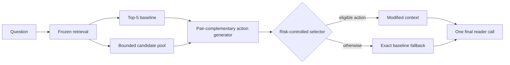

## 1. Introduction

Multi-hop question answering requires more than collecting passages that are individually relevant. A reader must receive complementary evidence together, within a fixed context budget and in a usable order. One passage may establish an entity relation, another may contain the answer-bearing statement, and a third may be a highly ranked distractor. Improving evidence coverage can therefore help supporting-fact prediction while also displacing wording that the answer reader needs. The optimization object is an ordered reader context, not merely a list of relevance scores.

A learned selector faces an upstream constraint: it can choose only among the actions generated for a query. If every proposed insertion, replacement, or reordering omits one hop or removes a useful baseline passage, even a perfect selector over that set cannot recover a compatible context. We call the difference between the available bounded actions and useful reader-compatible alternatives the **candidate-opportunity gap**. An unavailable repair cannot be selected, but availability alone is insufficient because the frozen policy realizes only a limited share of retrospective action-set utility.

Independent relevance reranking offers a strong alternative. A CrossEncoder can move individually relevant documents toward the top and may recover supporting evidence without explicitly constructing pairs. It does not, however, directly represent whether two moderate-scoring passages play complementary hops or whether replacing a baseline passage changes answer expression. This distinction is empirical rather than absolute: a strong independent reranker may still recover much of the downstream gain. The paper therefore evaluates independent relevance and pair-complementary construction under the same pool, document budget, reader, support predictor, and official metrics.

Our Full system starts from a frozen Top-5 context and an approximately ten-document post-retrieval pool. It scores document opportunity and pair complementarity, constructs bounded two-document chains, and retains strong early baseline anchors when the five-document budget permits. The action generator never edits source text or changes the upstream retriever. Its purpose is to expose a small set of structurally different contexts that an independent document ordering may not represent.

A separate preservation head and utility head decide whether one generated action should replace the baseline. If both frozen gates and the fold-level coverage budget pass, the policy applies the highest-ranked eligible action; otherwise it returns the original Top-5 context exactly. We call this **risk-controlled selection**. Risk-controlled denotes an empirically calibrated, answer-preservation-oriented selection objective; it does not provide a per-query harm guarantee. Full is selective in modifying contexts, not in executing its generator and selector, which run for every query.

Evaluation is fully nested to prevent reader outcomes from leaking into test decisions. Generator modules and selector heads fit outer-training queries, inner out-of-fold predictions determine thresholds and coverage, and outer-test outcomes remain unseen. The complete pipeline is then frozen before two disjoint same-source HotpotQA evaluations of 3,000 and 3,405 queries. Candidate reader outcomes are offline labels only; inference uses question, passages, baseline order, frozen features, and learned parameters, followed by one final reader call.

Full produces modest replicated population gains. Answer/supporting-fact (SP)/Joint F1 change by +0.0088/+0.0056/+0.0064 and +0.0116/+0.0061/+0.0080 at 25.8%-25.9% intervention coverage. Selected Answer F1 decreases on 7.75%-7.83% of interventions, and measured post-retrieval latency rises from 140.88 to 213.48 ms/query. These are same-source quality-risk-cost results, not broad safety or efficiency claims.

Two post-hoc analyses change how the result should be interpreted. First, protocol-matched CrossEncoder-Top5 reaches higher SP and Joint F1 at 149.90 ms/query, but its Answer F1 is below both Full and the frozen baseline. Full and CrossEncoder thus occupy different answer-evidence-latency operating points; neither dominates across all reported objectives. Second, an outcome-aware oracle restricted to the existing action set remains substantially above the frozen policy. The new diagnostics show that neither action construction nor policy selection alone determines performance: candidate availability and selector regret are separate bottlenecks.

Our contributions are threefold:

1. We formulate candidate opportunity as a constraint on reader-aware context selection and introduce bounded, pair-complementary, anchor-preserving actions.
2. We provide a fully nested, leak-free selective-policy evaluation on two frozen same-source holdouts, separating population effects, intervention risk, and measured cost.
3. We decompose candidate availability and selector regret, and compare Full with protocol-matched independent relevance reranking to characterize an answer-evidence-cost trade-off.

**Figure 1: Candidate opportunity and the risk-controlled context-construction pipeline.** The selector can only choose from generated actions; unavailable repairs and missed available actions are distinct failure modes. No answer, support annotation, or candidate reader outcome is used at inference.

