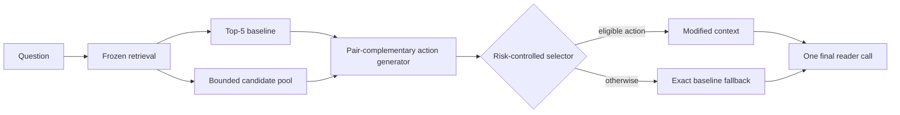

# Opportunity-Aware Context Construction with Risk-Controlled Selection for Multi-Hop QA

Multi-hop question answering requires complementary evidence without displacing passages that express the answer. Yet a selector can only choose among contexts exposed by its generator, creating a candidate-opportunity gap. We introduce Full, which constructs bounded pair-complementary, anchor-preserving context actions and applies them through a fully nested risk-controlled policy with exact fallback. Risk-controlled denotes an empirically calibrated, answer-preservation-oriented selection objective; it does not provide a per-query harm guarantee. On two disjoint frozen HotpotQA holdouts of 3,000 and 3,405 queries, Full yields modest Answer/supporting-fact/Joint F1 changes of +0.0088/+0.0056/+0.0064 and +0.0116/+0.0061/+0.0080 at approximately 26% intervention coverage. A protocol-matched independent CrossEncoder reranker improves supporting-fact and Joint F1 more strongly but lowers Answer F1, placing Full at a distinct answer-evidence operating point. Retrospective diagnostics show that both missing candidate opportunities and selector regret remain substantial. Full also incurs greater measured post-retrieval latency than the baseline and independent reranker. The evidence establishes a bounded same-source answer-evidence-risk-cost trade-off, not universal reranking superiority, low-cost deployment, or cross-domain reliability.

## 1. Introduction

Multi-hop question answering requires more than collecting passages that are individually relevant. A reader must receive complementary evidence together, within a fixed context budget and in a usable order. One passage may establish an entity relation, another may contain the answer-bearing statement, and a third may be a highly ranked distractor. Improving evidence coverage can therefore help supporting-fact prediction while also displacing wording that the answer reader needs. The optimization object is an ordered reader context, not merely a list of relevance scores.

A learned selector faces an upstream constraint: it can choose only among the actions generated for a query. If every proposed insertion, replacement, or reordering omits one hop or removes a useful baseline passage, even a perfect selector over that set cannot recover a compatible context. We call the difference between the available bounded actions and useful reader-compatible alternatives the **candidate-opportunity gap**. An unavailable repair cannot be selected, but availability alone is insufficient because the frozen policy realizes only a limited share of retrospective action-set utility.

Independent relevance reranking offers a strong alternative. A CrossEncoder can move individually relevant documents toward the top and may recover supporting evidence without explicitly constructing pairs. It does not, however, directly represent whether two moderate-scoring passages play complementary hops or whether replacing a baseline passage changes answer expression. This distinction is empirical rather than absolute: a strong independent reranker may still recover much of the downstream gain. The paper therefore evaluates independent relevance and pair-complementary construction under the same pool, document budget, reader, support predictor, and official metrics.

Our Full system starts from a frozen Top-5 context and an approximately ten-document post-retrieval pool. It scores document opportunity and pair complementarity, constructs bounded two-document chains, and retains strong early baseline anchors when the five-document budget permits. The action generator never edits source text or changes the upstream retriever. Its purpose is to expose a small set of structurally different contexts that an independent document ordering may not represent.

A separate preservation head and utility head decide whether one generated action should replace the baseline. If both frozen gates and the fold-level coverage budget pass, the policy applies the highest-ranked eligible action; otherwise it returns the original Top-5 context exactly. We call this **risk-controlled selection**. Risk-controlled denotes an empirically calibrated, answer-preservation-oriented selection objective; it does not provide a per-query harm guarantee. Full is selective in modifying contexts, not in executing its generator and selector, which run for every query.

Evaluation is fully nested to prevent reader outcomes from leaking into test decisions. Generator modules and selector heads fit outer-training queries, inner out-of-fold predictions determine thresholds and coverage, and outer-test outcomes remain unseen. The complete pipeline is then frozen before two disjoint same-source HotpotQA evaluations of 3,000 and 3,405 queries. Candidate reader outcomes are offline labels only; inference uses question, passages, baseline order, frozen features, and learned parameters, followed by one final reader call.

Full produces modest replicated population gains. Answer/supporting-fact (SP)/Joint F1 change by +0.0088/+0.0056/+0.0064 and +0.0116/+0.0061/+0.0080 at 25.8%-25.9% intervention coverage. Selected Answer F1 decreases on 7.75%-7.83% of interventions, and measured post-retrieval latency rises from 140.88 to 213.48 ms/query. These are same-source quality-risk-cost results, not broad safety or efficiency claims.

Two post-hoc analyses change how the result should be interpreted. First, protocol-matched CrossEncoder-Top5 reaches higher SP and Joint F1 at 149.90 ms/query, but its Answer F1 is below both Full and the frozen baseline. Full and CrossEncoder thus occupy different answer-evidence-latency operating points; neither dominates across all reported objectives. Second, an outcome-aware oracle restricted to the existing action set remains substantially above the frozen policy. The new diagnostics show that neither action construction nor policy selection alone determines performance: candidate availability and selector regret are separate bottlenecks.

Our contributions are threefold:

1. We formulate candidate opportunity as a constraint on reader-aware context selection and introduce bounded, pair-complementary, anchor-preserving actions.
2. We provide a fully nested, leak-free selective-policy evaluation on two frozen same-source holdouts, separating population effects, intervention risk, and measured cost.
3. We decompose candidate availability and selector regret, and compare Full with protocol-matched independent relevance reranking to characterize an answer-evidence-cost trade-off.

**Figure 1: Candidate opportunity and the risk-controlled context-construction pipeline.** The selector can only choose from generated actions; unavailable repairs and missed available actions are distinct failure modes. No answer, support annotation, or candidate reader outcome is used at inference.

## 2. Related Work

**Multi-hop retrieval and QA.** HotpotQA and 2WikiMultiHopQA pair answers with supporting facts, making it possible to distinguish answer generation from evidence access [@yang-etal-2018-hotpotqa; @ho-etal-2020-2wiki]. Multi-step retrievers such as MDR acquire evidence across retrieval steps [@xiong-etal-2021-mdr]. Our setting starts later: a frozen retriever has already produced a bounded candidate pool, and the method reorganizes that pool for a fixed reader.

**Reader-aware context construction.** Reader-aware retrieval and reranking account for downstream behavior beyond independent query-document relevance [@yu-etal-2024-rankrag; @xin-etal-2025-rcps; @lee-etal-2025-setr]. Prior analyses show that distractors and evidence position can alter reader output [@shi-etal-2023-distracted; @liu-etal-2024-lost]. We distinguish action opportunity from action selection: a risk-controlled selector remains limited by the combinations exposed by its generator.

**Compression and selective prediction.** RECOMP learns extractive context compression [@xu-etal-2024-recomp]. Because its released Hotpot configuration and our near-full contexts have different budgets and objectives, we use the author-released compressor under a common FLAN reader and include a 660-token condition plus a source-order truncation control. Selective prediction motivates fallback when estimated risk is high [@geifman-elyaniv-2019-selectivenet]. Here fallback means preserving the frozen retrieval baseline, and offline reader outcomes supervise the gate without adding online candidate-reader calls.

The closest systems differ along two axes: what actions they expose and how they decide whether to use them. Multi-step retrieval changes which documents enter the pool; RankRAG-like models improve ranking for generation; SetR/RCPS-style methods choose passage sets; RECOMP constructs compressed sentence contexts. Our method holds the retriever fixed and asks whether the bounded pool contains a context action that jointly preserves answer expression and improves reader utility. We do not claim that earlier work never creates candidates. The contribution is to make action availability explicit, generate complementary pair actions, and evaluate opportunity separately from selective intervention risk.

## 3. Problem and Method

### 3.1 Problem and Opportunity

For a question $q$, a frozen retriever returns a bounded document pool $D_q$ and ordered Top-5 baseline $C_0(q)$. A context action maps $C_0$ to another five-document sequence using only documents in $D_q$ and without editing source text. The generator exposes a finite action set $A(q)$; the selector either chooses one action or returns $C_0$.

During training only, an action receives an answer-preservation label when the frozen reader's Answer F1 is no lower than on $C_0$, and a positive-utility label when it improves the reader-side joint answer-evidence utility. Query opportunity is the existence of at least one action satisfying both labels in $A(q)$. It is an empirical upper bound for any selector restricted to that set, not an inference-time label or guarantee.

### 3.2 Full Pair-Complementary Action Generator

#### 3.2.1 Candidate document signals

The Full generator computes normalized BM25, question-title and question-text overlap, named-entity overlap, bridge overlap with baseline documents, novelty, and redundancy. It augments these lexical signals with cached MPNet query-document similarities [@song-etal-2020-mpnet] and cross-encoder relevance. At test time these features use only the question, candidate text, baseline ordering, and learned parameters; answers, support annotations, and reader outcomes are absent.

#### 3.2.2 Missing-hop and document-opportunity modules

A missing-hop estimator summarizes which query and baseline signals remain weakly represented. A document-opportunity model then scores whether a candidate can fill that estimated gap while adding nonredundant information. Both models are trained inside each outer fold from training-query outcomes. They are components of the empirically stronger Full implementation, not independently established monotonic contributions.

#### 3.2.3 Pair complementarity

Individual relevance cannot determine whether two documents jointly supply different hops. For each pair among the top candidate set, the generator constructs features from their individual scores, entity-chain overlap, combined novelty, redundancy, and relation to the missing-hop state. A balanced pair classifier estimates complementarity. With at most $L$ candidate documents, pair scoring is bounded by $L(L-1)/2$; the frozen deployment uses ten pair scores per query.

#### 3.2.4 Bounded two-document chain construction

High-scoring complementary pairs form bounded two-document actions. The pair is inserted into weak tail positions of the five-document baseline, producing a compact chain rather than an unconstrained search over permutations. The generator also retains a small single-complementary-insertion family. Duplicate contexts are removed, and the candidate action count is capped before selection.

#### 3.2.5 Anchor preservation and action pruning

The constructor protects the strongest early baseline anchors whenever the budget permits. This prevents an apparently useful support insertion from deleting the passage that supplies answer wording. Actions that duplicate a context, violate the five-document budget, or rank below the frozen pruning rule are discarded. Fallback is always present.

### 3.3 Risk-Controlled Selector

The selector has two balanced logistic heads. The preservation head estimates whether an action retains baseline answer quality; the utility head estimates whether it yields a positive reader-side change. Inner out-of-fold predictions determine both thresholds and a 10-30% coverage budget. On an outer-test query, an action is eligible only if it passes both heads. The highest-ranked eligible action is applied while the fold-level budget remains; all other queries receive the exact baseline. The reader then evaluates one final context. These estimates control average intervention risk but do not certify individual actions.

### 3.4 Training supervision and inference contract

Candidate outcomes are produced offline by replaying the frozen reader on actions generated from outer-training queries. An action is labeled preserved when its Answer F1 is no lower than the corresponding baseline and positive when its joint answer-evidence utility increases. These labels supervise document, pair, preservation, and utility models; they are never features. At inference, the contract is limited to the question, candidate passages, baseline order, lexical/entity/semantic scores, and learned parameters. The system does not inspect gold answers, supporting facts, or candidate reader predictions, and it does not call the reader to search among actions.

This distinction matters for both validity and cost. The policy is reader-aware because reader outcomes define training targets, but deployment is not an expensive per-candidate reader loop. The chosen or fallback context is serialized once and passed to the same frozen answer reader used by baseline.

## 4. Fully Nested Protocol

### 4.1 Fully Nested Training and Evaluation

Five outer folds separate training from evaluation. Generator modules and selector heads fit only outer-training queries. Inner folds tune thresholds and coverage without reading outer-test outcomes. Each outer-test query is processed by fold-specific frozen models. The 3,000-query and 3,405-query holdouts are disjoint from the 1,000 development queries, and no holdout outcome selects an architecture or threshold.

### 4.2 Experimental setup

We use HotpotQA distractor validation [@yang-etal-2018-hotpotqa]. A fixed 1,000-query development slice supports nested training and threshold selection. The next disjoint 3,000 queries form the original confirmatory holdout; the remaining 3,405 form an untouched revision holdout. All retain the same source distribution and are not external-domain tests.

The frozen upstream baseline is HybridSoftRetriever with alpha 0.55, uniform document weights, and Top-5 output. FLAN-T5-Large is the primary answer reader [@raffel-etal-2020-t5], using greedy decoding, at most 32 generated tokens, a 1,024-token input limit, and context capped at 3,200 characters. A Hotpot-development support predictor uses a frozen 0.7 threshold. We report official Answer, supporting-fact (SP), and Joint EM/F1. Paired 95% intervals and two-sided p-values use 5,000 query-level bootstrap resamples.

For RECOMP, the author-released HotpotQA compressor scores sentences in the same Top-5 input [@xu-etal-2024-recomp]. Development budgets are 64, 128, 256, 384, 512, and 660 FLAN tokens; 660 is frozen before holdout evaluation. Baseline-Truncated retains source sentence order at the same budget. All systems share reader, prompt, support predictor, and metric code.

For online cost, all systems run on one GPU with batch size one over the same ordered queries. We use 50 warmup queries and measure the next 500, synchronizing CUDA around every component. Model loading is excluded. Online features/actions are recomputed and their final context must exactly match the frozen artifact. Candidate outcome labeling and training are offline.

The confirmatory samples are constructed from a fixed ordering and audited for query-ID overlap. The original 3,000-query holdout is opened only after the nested development pipeline is frozen. The remaining 3,405 queries are untouched while the Lite architecture and 0.002 non-inferiority margin are fixed. Statistical intervals and p-values are query-level paired bootstrap estimates, so every comparison preserves the baseline/action pairing for the same question. The second sample is not used to retune Full after the first result.

## 5. Main Results

### 5.1 Frozen Same-Source Holdouts

| Frozen split | N | Coverage | Answer delta | SP delta | Joint delta | Selected Answer-drop | Selected Joint-drop |
| --- | ---: | ---: | ---: | ---: | ---: | ---: | ---: |
| Original holdout | 3,000 | 25.8% | +0.0088 | +0.0056 | +0.0064 | 7.75% | 14.86% |
| Revision holdout | 3,405 | 25.9% | +0.0116 | +0.0061 | +0.0080 | 7.83% | 14.19% |

Full improves Answer, SP, and Joint F1 on both frozen holdouts. On the original holdout, baseline/Full values are 0.6183/0.6271 for Answer, 0.4930/0.4987 for SP, and 0.3292/0.3356 for Joint. On the revision holdout they are 0.6129/0.6244, 0.4862/0.4923, and 0.3201/0.3280. Paired 95% intervals exclude zero for all six population deltas. Because both samples come from HotpotQA distractor validation, they provide same-source replication rather than external generalization.

The effects are modest at population level. Full changes only about 26% of contexts, and most selected queries tie the baseline. Selected-query means are descriptive conditional summaries rather than effects of intervening on arbitrary queries. The nonzero Answer- and Joint-drop rates also show why risk control is an empirical operating rule rather than a guarantee.

### 5.2 Answer-Evidence Trade-off against Independent Reranking

CrossEncoder-Top5 independently scores every document in the same approximately ten-document pool and retains five. It shares the frozen relevance checkpoint, reader, prompt, 3,200-character cap, support predictor, and official metrics with Full, but excludes pair, missing-hop, outcome-model, and selector features. Score order is chosen on development only and then frozen. Because this comparison was added after the primary study, it is a post-hoc secondary baseline analysis.

| Split | System | Answer F1 | SP F1 | Joint F1 | Latency (ms/query) |
| --- | --- | ---: | ---: | ---: | ---: |
| Original 3,000 | Frozen Top-5 | 0.6183 | 0.4930 | 0.3292 | 140.88 |
| Original 3,000 | CrossEncoder-Top5 | 0.6078 | 0.5240 | 0.3420 | 149.90 |
| Original 3,000 | Full | 0.6271 | 0.4987 | 0.3356 | 213.48 |
| Revision 3,405 | Frozen Top-5 | 0.6129 | 0.4862 | 0.3201 | 140.88 |
| Revision 3,405 | CrossEncoder-Top5 | 0.6063 | 0.5220 | 0.3405 | 149.90 |
| Revision 3,405 | Full | 0.6244 | 0.4923 | 0.3280 | 213.48 |

CrossEncoder improves SP and Joint more strongly than Full, but changes Answer F1 relative to baseline by -0.0105 and -0.0066. Full improves both Answer and Joint relative to baseline, but costs more and has lower SP/Joint than CrossEncoder. CrossEncoder minus Full Joint F1 is +0.0064 on the original holdout (95% CI [-0.0033,+0.0156], p=0.1884) and +0.0124 on the revision holdout ([+0.0034,+0.0211], p=0.0068). Full minus CrossEncoder Answer F1 is +0.0193/+0.0181. With Answer and Joint maximized and latency minimized, Full is a non-dominated answer-oriented operating point among the evaluated systems and metrics; CrossEncoder is another non-dominated point. Neither dominates all reported objectives.

**Figure 2:** Frozen operating points. RECOMP-660 appears only on the original holdout and Lite only on the revision holdout because no corresponding frozen result exists on the other split. Non-dominance is assessed only among the evaluated systems, metrics, and measured post-retrieval latency.

The paired outcomes make the aggregate trade-off more precise. CE improves SP while lowering Answer on 63 (2.1%) and 74 (2.2%) queries. Direct opposition where Full improves Answer and CE lowers it occurs on only 1/0 queries, so the population difference should not be reduced to one common per-query failure mode.

| Post-hoc event | Original 3,000 | Revision 3,405 |
| --- | ---: | ---: |
| CE SP up, Answer down | 63 (2.1%) | 74 (2.2%) |
| Full Answer up, CE Answer down | 1 (0.0%) | 0 (0.0%) |
| Both Joint up | 102 (3.4%) | 127 (3.7%) |

This disagreement analysis uses frozen per-query outcomes and is descriptive. The artifacts do not contain a reliable explicit answer-anchor label, so we do not create an outcome-derived proxy or claim a causal anchor mechanism.

### 5.3 Candidate Opportunity and Selector Regret

The frozen action-set decomposition separates queries with no positive action under the training definition from queries where such an action exists but the policy misses it. A positive action is one labeled answer-compatible and utility-improving in the original offline training protocol.

| Split | No positive action | Positive action missed | Positive action selected |
| --- | ---: | ---: | ---: |
| Original 3,000 | 2,316 | 465 | 219 |
| Revision 3,405 | 2,638 | 515 | 252 |

The retrospective answer-preserving oracle remains substantially above the frozen policy, indicating large selector regret within the available action set. Because it inspects target-query reader outcomes, it is a diagnostic rather than a deployable system or fair inference-time competitor. The table also shows that selector improvement alone cannot repair queries whose bounded action set lacks a training-positive alternative. Availability and selection are therefore separate, substantial limitations. Full oracle definitions, absolute metrics, gain ratios, regret quantiles, and query-level details are moved to the supplement.

## 6. Mechanism and Cost

### 6.1 Core Components

| Generator variant | Positive-action density | Opportunity coverage | Training-label preservation rate | Interpretation |
| --- | ---: | ---: | ---: | --- |
| Full | 14.71% | 29.2% | 92.66% | Frozen joint recipe |
| Without pair complementarity | 10.27% | 27.7% | 93.07% | Clearest learned opportunity loss |
| Without two-document chains | 10.40% | 25.1% | 93.69% | Clearest structural coverage loss |
| Without anchor-preserving families | 16.57% | 27.4% | 92.45% | Higher density but narrower coverage |
| Lite-Lexical-Pair | -- | -- | -- | 0.3217 Joint vs Full 0.3280; NI failed |

Removing pair complementarity or two-document chains produces the clearest development opportunity losses. Removing anchor-preserving families changes both the action denominator and coverage, so its higher positive density is not a monotonic improvement. These outcomes support the frozen joint recipe and pair/chain mechanisms, not the necessity of every semantic feature. Opportunity and preservation rates use offline development outcomes for mechanism analysis; they are not inference-time labels or guarantees.

### 6.2 Quality-Risk-Cost Analysis

| System / boundary | Frozen split | Joint contrast | Coverage | Selected Answer-drop | Latency | Interpretation |
| --- | --- | ---: | ---: | ---: | ---: | --- |
| Frozen Top-5 | Original 3,000 | reference | 0% | 0% | 140.88 ms | Exact baseline |
| CrossEncoder-Top5 | Original 3,000 | +0.0128 | 100% reranked | -- | 149.90 ms | Higher SP/Joint, lower Answer |
| Full | Original 3,000 | +0.0064 | 25.8% modified | 7.75% | 213.48 ms | Answer-oriented selective point |
| Lite | Revision 3,405 | -0.0063 vs Full | -- | -- | 143.97 ms | Cheaper; NI failed |
| RECOMP-660 | Original 3,000 | -0.0033 vs baseline | 100% compressed | -- | 169.64 ms | Budget control; p=0.4172 |

Full runs its generator and selector for every query even though it modifies only approximately 26% of contexts. It is selective in context modification, not in whether computation is executed. Full adds 72.60 ms/query over baseline, a 1.52x ratio, and is 63.58 ms slower than CrossEncoder-Top5. All evaluated online systems make one final answer-reader call; candidate reader outcomes are offline supervision.

Lite nearly restores baseline latency but fails the pre-frozen 0.002 Joint-F1 non-inferiority test on the revision holdout. RECOMP-660 uses the same Top-5 input, reader, support predictor, and approximately matched context budget, but its structural action space differs and its Joint change is non-significant. Pair-score pruning provides little latency reduction because semantic feature computation, rather than the number of retained pair actions, dominates generator cost: reducing k from 10 to 3 changes the component-scaled estimate only from 213.48 to 212.04 ms/query. The complete pruning sensitivity remains in the supplement and no pruned method is promoted.

Latency uses one GPU, batch size one, 50 warmup queries, and 500 measured queries with CUDA synchronization. Model loading and upstream retrieval are excluded. These measurements characterize one post-retrieval setup, not throughput, energy, mobile hardware, or a production service-level guarantee.

## 7. External Boundary

Frozen transfer to 1,000 2Wiki queries changes Answer/SP/Joint F1 by +0.0086/-0.0006/+0.0033; all aggregate changes are non-significant. Selected Answer-drop is 6.92%. Few-shot gate calibration reduces coverage but still reaches 5.10% Answer-drop, missing the pre-specified 4% target, so no further target-outcome tuning is performed.

Type-level analysis uses the official 2Wiki reasoning field, and no subgroup survives Benjamini-Hochberg correction. The official reasoning taxonomy therefore does not explain the aggregate transfer uncertainty after multiplicity correction. Feature diagnostics show shifts in lexical, entity, candidate, and score distributions, but these associations do not identify a root cause or a corrective mechanism.

Future analysis should test mechanism-aligned groupings, such as explicit bridge availability and answer-anchor dependence, under a separately frozen protocol. The present evidence does not establish cross-domain reliability or subgroup transfer.

## 8. Limitations and Ethical Considerations

The population effects are small, and risk control is empirical rather than certifying: 7.75%-7.83% of selected actions lower Answer F1 and 14.19%-14.86% lower Joint F1. The action-set oracle is outcome-aware and unattainable online. Its large gap is evidence of selector regret, not a prediction that the deployed policy can reach oracle performance. CrossEncoder-Top5 recovers more SP/Joint gain at lower latency than Full, which limits the incremental claim attributable to pair-complementary construction.

Both primary holdouts come from HotpotQA distractor validation. Disjointness and freezing establish same-source replication, not domain generalization. Frozen 2Wiki transfer is non-significant and calibration misses its risk target. The evaluated candidate pool contains approximately ten documents; Full scores ten pairs per query. Pair pruning does not resolve larger-pool complexity, and no claim is made about corpus-scale retrieval, changing indexes, or web search.

Full costs 213.48 ms/query on the measured A100 setup and runs generator and selector computation for every query. Lite's non-inferiority test fails, historical offline GPU-hour totals are unavailable, and no energy or alternative-hardware profile is reported. The work therefore makes no low-overhead, edge, privacy, or distributed-client claim.

The method rearranges retrieved passages and cannot recover evidence absent from the pool. Risk estimates or support predictions may behave differently across question and entity groups. Consequential use would require target-domain calibration, subgroup auditing, and explicit tolerance choices for Answer, evidence, latency, and intervention harm.

## 9. Conclusion

Multi-hop context intervention is limited jointly by the actions made available and the ability of a frozen selector to identify useful, answer-compatible choices. Full expands the bounded action set with pair-complementary, anchor-preserving contexts and improves Answer and Joint F1 over the frozen baseline on two same-source holdouts. A protocol-matched CrossEncoder reranker instead attains higher SP and Joint F1 at lower latency than Full, while lowering Answer F1 below baseline. Full is therefore a distinct answer-oriented operating point among the evaluated systems and metrics, not a universally superior reranker.

The retrospective oracle further shows substantial selector regret within the available action set, while the decomposition also identifies many queries with no training-positive action. Full incurs 1.52x baseline post-retrieval latency, pair-score pruning saves little, and frozen 2Wiki transfer remains non-significant. The contribution is a fully nested method and analysis of candidate availability, selective realization, and measured answer-evidence-risk-cost trade-offs under a bounded same-source protocol. It does not establish a per-query harm guarantee, corpus-scale efficiency, or cross-domain reliability.
