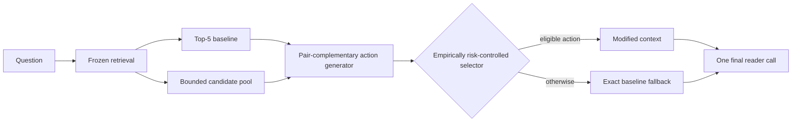

## 1. Introduction

Multi-hop question answering succeeds only when the reader receives evidence that is not merely relevant, but jointly usable. One passage may identify the bridge entity, another may supply the answer-bearing statement, and an individually strong distractor may consume the same limited context budget. The retrieval problem is therefore compositional: construct an ordered context that exposes complementary reasoning roles while retaining the information needed to express the answer.

This view reveals a constraint that is easy to overlook when attention is placed only on the final selector. A policy can choose only among the contexts produced for a query. If the bounded action set contains no answer-compatible repair, improved decision accuracy cannot recover one. We call this the **candidate-opportunity gap**. Candidate availability is necessary, but the frozen-action diagnostic also shows that availability is not sufficient: useful actions can exist and still remain unrealized by the deployed policy. Multi-hop context intervention is governed jointly by what actions are available and how reliably they are selected.

Independent relevance scoring provides an important reference point. A strong CrossEncoder can recover supporting evidence by moving individually relevant documents upward, even without explicit pair construction. However, independent scores do not directly encode whether two passages occupy complementary hops or whether a replacement changes answer expression. The empirical question is therefore which answer-evidence-cost operating points emerge when pool, document budget, reader, support predictor, and evaluation code are held fixed.

We address this question with **Full**, an opportunity-aware context constructor over a frozen approximately ten-document pool. Starting from a Top-5 baseline, Full combines lexical, entity, semantic, and missing-hop signals; scores document opportunity and pair complementarity; and exposes bounded insertion, replacement, reordering, and two-document-chain actions. Anchor-preserving action families retain strong early baseline passages when the five-document budget permits. The upstream retriever and source text remain unchanged.

A preservation head and utility head then determine whether to apply one action or return the baseline exactly. We call this **risk-controlled selection** in an empirical sense: it is an answer-preservation-oriented operating rule calibrated on nested development data, not a per-query harm guarantee and not conformal risk control. The selector modifies approximately 26% of contexts, but Full executes its generator and selector for every query. One final reader call is made after the context decision.

The evaluation protocol makes this claim auditable. Generator modules and selector heads fit outer-training queries; inner out-of-fold predictions determine thresholds and coverage; and outer-test outcomes remain unseen. The complete pipeline is frozen before evaluation on two disjoint same-source HotpotQA samples of 3,000 and 3,405 queries. Candidate reader outcomes serve only as offline training labels. At inference, Full uses the question, candidate passages, baseline order, frozen features, and learned parameters. The no-leak audit verifies query separation, fold-matched training, absent target outcomes in inference features, and unchanged holdout thresholds.

Across both evaluations, Answer, supporting-fact (SP), and Joint F1 move in the same positive direction. The deltas are +0.0088/+0.0056/+0.0064 and +0.0116/+0.0061/+0.0080, with paired confidence intervals excluding zero. This consistency links a selective context intervention to population-level reader outcomes under two disjoint frozen same-source evaluations, rather than only to conditional gains on edited examples.

The shared-checkpoint CrossEncoder reaches higher SP and Joint at 149.90 ms/query; Full reaches higher Answer and improves Answer and Joint over baseline at 213.48 ms/query. Neither dominates all objectives. Frozen-action diagnostics further separate absent training-positive actions from selector misses.

This is a method-and-analysis study: Full provides the controlled intervention system, while the frozen comparisons separate candidate availability, selector realization, and answer-evidence-cost objectives.

Our contributions are threefold:

1. We formulate candidate opportunity as a constraint on reader-aware context selection and introduce bounded pair-complementary, anchor-preserving actions.
2. We provide a fully nested, leakage-controlled evaluation with an explicit no-leak audit on two disjoint frozen same-source evaluations, connecting selective interventions to Answer, SP, and Joint improvements while measuring observed intervention risk and latency.
3. We separate candidate availability from selector regret and use a protocol-matched shared-checkpoint CrossEncoder baseline to characterize distinct answer-evidence-cost operating points.

**Figure 1: Candidate opportunity and the empirically risk-controlled context-construction pipeline.** The selector can only choose from generated actions; unavailable repairs and missed available actions are distinct sources of unrealized utility. No answer, support annotation, or candidate reader outcome is used at inference.

