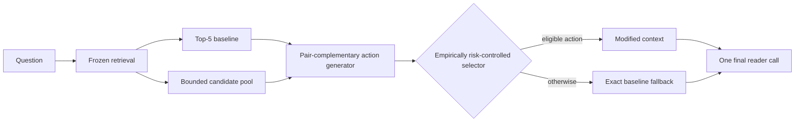

# Opportunity-Aware Context Construction with Risk-Controlled Selection for Multi-Hop QA

Multi-hop question answering depends on assembling complementary evidence into a context that remains usable by the answer reader. Yet a selector can act only on alternatives exposed by its generator, coupling candidate availability with policy realization. We introduce Full, a bounded context-construction system that combines pair-complementary, anchor-preserving actions with a fully nested, empirically risk-controlled selector and exact fallback. Across two disjoint frozen same-source HotpotQA evaluations of 3,000 and 3,405 queries, Full improves Answer, supporting-fact, and Joint F1 by +0.0088/+0.0056/+0.0064 and +0.0116/+0.0061/+0.0080 at 25.8%-25.9% intervention coverage. A protocol-matched shared-checkpoint CrossEncoder reranker reaches higher supporting-fact and Joint F1 at lower latency, whereas Full attains higher Answer F1 and improves both Answer and Joint over the frozen baseline. These systems expose distinct answer-evidence-cost operating points. Retrospective frozen-action diagnostics further separate absent training-positive actions from missed available actions. Together, the results provide a fully nested, leakage-controlled analysis of candidate opportunity, selective realization, observed intervention risk, and measured cost in bounded multi-hop context construction, with same-source replication and explicit transfer boundaries.

## 1. Introduction

Multi-hop question answering succeeds only when the reader receives evidence that is not merely relevant, but jointly usable. One passage may identify the bridge entity, another may supply the answer-bearing statement, and an individually strong distractor may consume the same limited context budget. The retrieval problem is therefore compositional: construct an ordered context that exposes complementary reasoning roles while retaining the information needed to express the answer.

This view reveals a constraint that is easy to overlook when attention is placed only on the final selector. A policy can choose only among the contexts produced for a query. If the bounded action set contains no answer-compatible repair, improved decision accuracy cannot recover one. We call this the **candidate-opportunity gap**. Candidate availability is necessary, but the frozen-action diagnostic also shows that availability is not sufficient: useful actions can exist and still remain unrealized by the deployed policy. Multi-hop context intervention is governed jointly by what actions are available and how reliably they are selected.

Independent relevance scoring provides an important reference point. A strong CrossEncoder can recover supporting evidence by moving individually relevant documents upward, even without explicit pair construction. However, independent scores do not directly encode whether two passages occupy complementary hops or whether a replacement changes answer expression. The empirical question is therefore which answer-evidence-cost operating points emerge when pool, document budget, reader, support predictor, and evaluation code are held fixed.

We address this question with **Full**, an opportunity-aware context constructor over a frozen approximately ten-document pool. Starting from a Top-5 baseline, Full combines lexical, entity, semantic, and missing-hop signals; scores document opportunity and pair complementarity; and exposes bounded insertion, replacement, reordering, and two-document-chain actions. Anchor-preserving action families retain strong early baseline passages when the five-document budget permits. The upstream retriever and source text remain unchanged.

A preservation head and utility head then determine whether to apply one action or return the baseline exactly. We call this **risk-controlled selection** in an empirical sense: it is an answer-preservation-oriented operating rule calibrated on nested development data, not a per-query harm guarantee and not conformal risk control. The selector modifies approximately 26% of contexts, but Full executes its generator and selector for every query. One final reader call is made after the context decision.

The evaluation protocol makes this claim auditable. Generator modules and selector heads fit outer-training queries; inner out-of-fold predictions determine thresholds and coverage; and outer-test outcomes remain unseen. The complete pipeline is frozen before evaluation on two disjoint same-source HotpotQA samples of 3,000 and 3,405 queries. Candidate reader outcomes serve only as offline training labels. At inference, Full uses the question, candidate passages, baseline order, frozen features, and learned parameters. The no-leak audit verifies query separation, fold-matched training, absent target outcomes in inference features, and unchanged holdout thresholds.

Across both evaluations, Answer, supporting-fact (SP), and Joint F1 move in the same positive direction. The deltas are +0.0088/+0.0056/+0.0064 and +0.0116/+0.0061/+0.0080, with paired confidence intervals excluding zero. This consistency links a selective context intervention to population-level reader outcomes under two disjoint frozen same-source evaluations, rather than only to conditional gains on edited examples.

The shared-checkpoint CrossEncoder reaches higher SP and Joint at 149.90 ms/query; Full reaches higher Answer and improves Answer and Joint over baseline at 213.48 ms/query. Neither dominates all objectives. Frozen-action diagnostics further separate absent training-positive actions from selector misses.

This is a method-and-analysis study: Full provides the controlled intervention system, while the frozen comparisons separate candidate availability, selector realization, and answer-evidence-cost objectives.

Our contributions are threefold:

1. We formulate candidate opportunity as a constraint on reader-aware context selection and introduce bounded pair-complementary, anchor-preserving actions.
2. We provide a fully nested, leakage-controlled evaluation with an explicit no-leak audit on two disjoint frozen same-source evaluations, connecting selective interventions to Answer, SP, and Joint improvements while measuring observed intervention risk and latency.
3. We separate candidate availability from selector regret and use a protocol-matched shared-checkpoint CrossEncoder baseline to characterize distinct answer-evidence-cost operating points.

**Figure 1: Candidate opportunity and the empirically risk-controlled context-construction pipeline.** The selector can only choose from generated actions; unavailable repairs and missed available actions are distinct sources of unrealized utility. No answer, support annotation, or candidate reader outcome is used at inference.

## 2. Related Work

**Multi-hop retrieval and structured QA.** HotpotQA and 2WikiMultiHopQA pair answers with supporting facts, enabling separate measurement of answer generation and evidence access [@yang-etal-2018-hotpotqa; @ho-etal-2020-2wiki]. MDR changes the candidate pool through multi-step dense retrieval [@xiong-etal-2021-mdr], while HGN propagates paragraph, sentence, and entity information in a graph reader [@fang-etal-2020-hgn]. Decomposition-first methods such as GenDec instead generate subquestions before retrieval [@wu-etal-2024-gendec]. Our intervention starts after a frozen retriever has produced a bounded pool; it changes neither the upstream index nor the reader architecture.

**Reader-aware ranking and context-set construction.** RankRAG jointly instruction-tunes ranking and generation [@yu-etal-2024-rankrag]. R-CPS ranks and clusters passages using reader prediction behavior [@xin-etal-2025-rcps], and SetR explicitly selects a collectively useful passage set [@lee-etal-2025-setr]. RECOMP learns extractive context compression [@xu-etal-2024-recomp]. Recent BAR-RAG work trains a boundary-aware selector from generator feedback, but is included only as a conceptual comparison because it is a recent preprint with a different two-stage training contract [@sun-etal-2026-barrag]. Full differs by preserving a fixed upstream pool and reader, generating bounded structured actions, and applying an offline outcome-supervised fallback gate without online candidate-reader search.

**Context sensitivity.** Reader output can change with distractors and evidence position [@shi-etal-2023-distracted; @liu-etal-2024-lost]. This motivates preserving strong baseline anchors and evaluating Answer, SP, and Joint jointly. Our analysis does not infer a causal answer-anchor mechanism from outcome differences; it reports the frozen operating points and observed intervention harms.

**Selective prediction and risk control.** SelectiveNet formalizes risk-coverage trade-offs through learned rejection [@geifman-elyaniv-2019-selectivenet]. Distribution-free risk-controlling prediction sets and Learn-then-Test provide finite-sample control under explicit calibration assumptions [@bates-etal-2021-rcps; @angelopoulos-etal-2021-ltt]. TRAQ applies conformal prediction to retrieval-augmented QA prediction sets [@li-etal-2024-traq], and C-RAG studies certified generation risk for RAG [@kang-etal-2024-crag]. Our gate is outcome-supervised and empirically calibrated on nested development data. It reports average observed intervention risk at one frozen operating point, but provides neither finite-sample coverage nor group-conditional guarantees. Extending answer-preservation selection with distribution-aware risk control is a separate research direction.

Closest systems differ in pool changes, online reader/generator calls, and empirical versus guaranteed risk. The supplement gives the complete contract matrix and verified source map.

## 3. Problem and Method

### 3.1 Problem and Opportunity

For a question $q$, a frozen retriever returns a bounded document pool $D_q$ and ordered Top-5 baseline $C_0(q)$. A context action maps $C_0$ to another five-document sequence using only documents in $D_q$ and without editing source text. The generator exposes a finite action set $A(q)$; the selector either chooses one action or returns $C_0$.

During training only, an action receives an answer-preservation label when the frozen reader's Answer F1 is no lower than on $C_0$, and a positive-utility label when it improves the reader-side joint answer-evidence utility. Query opportunity is the existence of at least one action satisfying both labels in $A(q)$. It is an empirical upper bound for any selector restricted to that set, not an inference-time label or guarantee.

### 3.2 Full Pair-Complementary Action Generator

#### 3.2.1 Candidate document signals

The Full generator computes normalized BM25, question-title and question-text overlap, named-entity overlap, bridge overlap with baseline documents, novelty, and redundancy. It augments these lexical signals with cached MPNet query-document similarities [@song-etal-2020-mpnet] and cross-encoder relevance. At test time these features use only the question, candidate text, baseline ordering, and learned parameters; answers, support annotations, and reader outcomes are absent.

#### 3.2.2 Missing-hop and document-opportunity modules

A missing-hop estimator summarizes which query and baseline signals remain weakly represented. A document-opportunity model then scores whether a candidate can fill that estimated gap while adding nonredundant information. Both models are trained inside each outer fold from training-query outcomes. They are components of the empirically stronger Full implementation, not independently established monotonic contributions.

#### 3.2.3 Pair complementarity

Individual relevance cannot determine whether two documents jointly supply different hops. For each pair among the top candidate set, the generator constructs features from their individual scores, entity-chain overlap, combined novelty, redundancy, and relation to the missing-hop state. A balanced pair classifier estimates complementarity. With at most $L$ candidate documents, pair scoring is bounded by $L(L-1)/2$; the frozen deployment uses ten pair scores per query.

#### 3.2.4 Bounded two-document chain construction

High-scoring complementary pairs form bounded two-document actions. The pair is inserted into weak tail positions of the five-document baseline, producing a compact chain rather than an unconstrained search over permutations. The generator also retains a small single-complementary-insertion family. Duplicate contexts are removed, and the candidate action count is capped before selection.

#### 3.2.5 Anchor preservation and action pruning

The constructor protects the strongest early baseline anchors whenever the budget permits. This prevents an apparently useful support insertion from deleting the passage that supplies answer wording. Actions that duplicate a context, violate the five-document budget, or rank below the frozen pruning rule are discarded. Fallback is always present.

### 3.3 Risk-Controlled Selector

The selector has two balanced logistic heads. The preservation head estimates whether an action retains baseline answer quality; the utility head estimates whether it yields a positive reader-side change. Inner out-of-fold predictions determine both thresholds and a 10-30% coverage budget. On an outer-test query, an action is eligible only if it passes both heads. The highest-ranked eligible action is applied while the fold-level budget remains; all other queries receive the exact baseline. The reader then evaluates one final context. These estimates control average intervention risk but do not certify individual actions.

### 3.4 Training supervision and inference contract

Candidate outcomes are produced offline by replaying the frozen reader on actions generated from outer-training queries. An action is labeled preserved when its Answer F1 is no lower than the corresponding baseline and positive when its joint answer-evidence utility increases. These labels supervise document, pair, preservation, and utility models; they are never features. At inference, the contract is limited to the question, candidate passages, baseline order, lexical/entity/semantic scores, and learned parameters. The system does not inspect gold answers, supporting facts, or candidate reader predictions, and it does not call the reader to search among actions.

This distinction matters for both validity and cost. The policy is reader-aware because reader outcomes define training targets, but deployment is not an expensive per-candidate reader loop. The chosen or fallback context is serialized once and passed to the same frozen answer reader used by baseline.

### 3.5 Component Contract

| Component | Training supervision | Inference inputs | Output |
| --- | --- | --- | --- |
| Missing-hop estimator | Outer-training missing-type labels from offline outcomes | Query and baseline lexical/entity/semantic summaries | Five missing-type probabilities |
| Document opportunity | Outer-training action usefulness labels | Query-document relevance, overlap, novelty, redundancy, bridge and rank features | Candidate opportunity score |
| Pair complementarity | Outer-training pair labels | Two document scores, pair similarity, entity chain, novelty and redundancy | Pair score |
| Action generator | No target-query outcome | Frozen baseline, candidate scores, pair scores, missing-hop state | At most eight unique five-document actions plus fallback |
| Preservation head | Offline Answer F1 non-decrease label | Generator score, removal risk, semantic/opportunity summaries, missing-type and family features | Answer-preservation probability |
| Utility head | Offline answer-compatible utility label | Same inference-safe action features | Positive-utility probability |
| Selector | Inner out-of-fold development predictions | Two probabilities and frozen fold budget | One action or exact baseline fallback |

All learned feature vectors are standardized inside their training pipeline. The supplement gives the exact feature order, labels, regularization, seeds, grids, caps, tie breaking, and fallback rule.

## 4. Fully Nested Protocol

### 4.1 Fully Nested Training and Evaluation

Five outer folds separate training from evaluation. Generator modules and selector heads fit only outer-training queries. Inner folds tune thresholds and coverage without reading outer-test outcomes. Each outer-test query is processed by fold-specific frozen models. The 3,000-query and 3,405-query samples are disjoint from the 1,000 development queries and from each other. They are same-source evaluations, not external replications. No holdout outcome selects Full's architecture, threshold, or coverage rule; the explicit no-leak audit checks query IDs, artifact fingerprints, fold membership, feature availability, and frozen configurations.

### 4.2 Experimental setup

We use HotpotQA distractor validation [@yang-etal-2018-hotpotqa]. A fixed 1,000-query development slice supports nested training and threshold selection. The next disjoint 3,000 queries form the original confirmatory holdout; the remaining 3,405 form an untouched revision holdout. All retain the same source distribution and are not external-domain tests.

The frozen upstream baseline is HybridSoftRetriever with alpha 0.55, uniform document weights, and Top-5 output. FLAN-T5-Large is the primary answer reader [@raffel-etal-2020-t5], using greedy decoding, at most 32 generated tokens, a 1,024-token input limit, and context capped at 3,200 characters. A Hotpot-development support predictor uses a pre-specified frozen 0.7 threshold; a fixed 0.5/0.6/0.7/0.8 post-hoc sensitivity grid is reported without changing the primary threshold. We report official Answer, supporting-fact (SP), and Joint EM/F1. Paired 95% intervals and two-sided p-values use 5,000 query-level bootstrap resamples.

For RECOMP, the author-released HotpotQA compressor scores the same Top-5 input [@xu-etal-2024-recomp]. A 660-token budget is frozen from a development grid; a source-order truncation control uses the same budget. Reader, support predictor, and metrics are shared.

Online cost uses one GPU, batch size one, 50 warmup and 500 measured queries with CUDA synchronization. Model loading and upstream retrieval are excluded; recomputed contexts must match frozen artifacts. Training and candidate labeling are offline.

A fixed ordering and query-ID audit define both frozen samples. The 3,000-query sample is opened after nested development freezing; the remaining 3,405 stay untouched while the Lite architecture and non-inferiority margin are fixed. Query-level paired bootstraps preserve same-question pairing. The second sample does not retune Full.

## 5. Main Results

### 5.1 Frozen Same-Source Holdouts

| Frozen split | N | Coverage | Answer delta | SP delta | Joint delta | Joint 95% CI | Paired p | Answer-drop |
| --- | ---: | ---: | ---: | ---: | ---: | ---: | ---: | ---: |
| Original holdout | 3,000 | 25.8% | +0.0088 | +0.0056 | +0.0064 | [+0.0027,+0.0104] | 0.0004 | 7.75% |
| Revision holdout | 3,405 | 25.9% | +0.0116 | +0.0061 | +0.0080 | [+0.0044,+0.0116] | <0.0004 | 7.83% |

Full improves Answer, SP, and Joint F1 on both frozen holdouts. On the original holdout, baseline/Full values are 0.6183/0.6271 for Answer, 0.4930/0.4987 for SP, and 0.3292/0.3356 for Joint. On the revision holdout they are 0.6129/0.6244, 0.4862/0.4923, and 0.3201/0.3280. Paired 95% intervals exclude zero for all six population deltas. Because both samples come from HotpotQA distractor validation, they provide same-source replication rather than external generalization.

Across the two disjoint frozen same-source evaluations, Answer, SP, and Joint all move in the same positive direction, and all six paired intervals exclude zero; Table 1 exposes the Joint interval and p-value directly. Full modifies about 26% of contexts. Most selected queries tie the baseline, while the Answer- and Joint-drop rates report observed intervention risk at this frozen operating point.

### 5.2 Answer-Evidence Trade-off against a Shared-Checkpoint Reranker

The protocol-matched shared-checkpoint CrossEncoder-Top5 baseline scores every document in the same approximately ten-document pool and selects and orders five using only relevance. Full uses the same frozen relevance checkpoint as one feature among lexical, entity, opportunity, complementarity, and structural signals; that feature does not itself choose Full's context. The baseline excludes pair, missing-hop, opportunity, preservation, utility, and action-family logic. Score order is chosen on development only and then frozen. Because this comparison was added after the primary study, it is a post-hoc secondary baseline analysis. The comparison isolates the value of the complete context-construction and selective-intervention pipeline beyond using the same relevance checkpoint as an independent document ranker. It is protocol-matched, not representation-level independent.

| Split | System | Answer F1 | SP F1 | Joint F1 | Latency (ms/query) |
| --- | --- | ---: | ---: | ---: | ---: |
| Original 3,000 | Frozen Top-5 | 0.6183 | 0.4930 | 0.3292 | 140.88 |
| Original 3,000 | CrossEncoder-Top5 | 0.6078 | 0.5240 | 0.3420 | 149.90 |
| Original 3,000 | Full | 0.6271 | 0.4987 | 0.3356 | 213.48 |
| Revision 3,405 | Frozen Top-5 | 0.6129 | 0.4862 | 0.3201 | 140.88 |
| Revision 3,405 | CrossEncoder-Top5 | 0.6063 | 0.5220 | 0.3405 | 149.90 |
| Revision 3,405 | Full | 0.6244 | 0.4923 | 0.3280 | 213.48 |

The matched comparison exposes a genuine multi-objective result. CrossEncoder moves further on SP and Joint, while changing Answer F1 relative to baseline by -0.0105 and -0.0066. Full improves both Answer and Joint over baseline and reaches Answer F1 +0.0193/+0.0181 above CrossEncoder, at higher latency. CrossEncoder minus Full Joint F1 is +0.0064 on the original holdout (95% CI [-0.0033,+0.0156], p=0.1884) and +0.0124 on the revision holdout ([+0.0034,+0.0211], p=0.0068). Among the evaluated systems and metrics, Full is a non-dominated Answer-oriented operating point and CrossEncoder is a non-dominated evidence-oriented point; neither dominates Answer, Joint, and latency simultaneously.

**Figure 2:** Frozen operating points. RECOMP-660 appears only on the original holdout and Lite only on the revision holdout because no corresponding frozen result exists on the other split. Non-dominance is assessed only among the evaluated systems, metrics, and measured post-retrieval latency.

The paired outcomes make the aggregate trade-off more precise. CE improves SP while lowering Answer on 63 (2.1%) and 74 (2.2%) queries. Direct opposition where Full improves Answer and CE lowers it occurs on only 1/0 queries, so the population difference should not be reduced to one common per-query failure mode.

| Post-hoc event | Original 3,000 | Revision 3,405 |
| --- | ---: | ---: |
| CE SP up, Answer down | 63 (2.1%) | 74 (2.2%) |
| Full Answer up, CE Answer down | 1 (0.0%) | 0 (0.0%) |
| Both Joint up | 102 (3.4%) | 127 (3.7%) |

This disagreement analysis uses frozen per-query outcomes and is descriptive. The artifacts do not contain a reliable explicit answer-anchor label, so we do not create an outcome-derived proxy or claim a causal anchor mechanism.

### 5.3 Candidate Opportunity and Selector Regret

The frozen action-set decomposition separates queries with no training-positive action from queries where such an action exists but the policy misses it. A training-positive action is one labeled answer-compatible and utility-improving in the original offline training protocol.

| Split | No training-positive action | Training-positive action missed | Training-positive action selected |
| --- | ---: | ---: | ---: |
| Development 1,000 | 708 | 213 | 79 |
| Original 3,000 | 2,316 | 465 | 219 |
| Revision 3,405 | 2,638 | 515 | 252 |

The same qualitative availability-versus-regret split appears on fully nested development outputs. The decomposition identifies two concrete sources of improvement headroom. Some queries contain no training-positive action in the bounded set; others contain one that the policy does not realize. The retrospective answer-preserving oracle quantifies the remaining action-set headroom but inspects target-query outcomes, so it is a diagnostic rather than a deployable system or fair inference-time competitor. Availability and selection are therefore distinct optimization targets. Full oracle definitions, absolute metrics, gain ratios, regret quantiles, and query-level details remain in the supplement.

A post-hoc fixed-grid support-threshold analysis at 0.5/0.6/0.7/0.8 keeps both Full-baseline SP and Joint deltas positive on both evaluations; the CrossEncoder directions are likewise stable. The pre-specified 0.7 threshold remains unchanged, and the complete table is in the supplement.

## 6. Mechanism and Cost

### 6.1 Core Components

| Generator variant | Positive-action density | Opportunity coverage | Training-label preservation rate | Interpretation |
| --- | ---: | ---: | ---: | --- |
| Full | 14.71% | 29.2% | 92.66% | Frozen joint recipe |
| Without pair complementarity | 10.27% | 27.7% | 93.07% | Clearest learned opportunity loss |
| Without two-document chains | 10.40% | 25.1% | 93.69% | Clearest structural coverage loss |
| Without anchor-preserving families | 16.57% | 27.4% | 92.45% | Higher density but narrower coverage |
| Lite-Lexical-Pair | -- | -- | -- | 0.3217 Joint vs Full 0.3280; NI failed |

Removing pair complementarity or two-document chains produces the clearest development opportunity losses. Removing anchor-preserving families changes both the action denominator and coverage, so its higher positive density is not a monotonic improvement. These outcomes are development opportunity diagnostics consistent with the frozen joint recipe; they do not establish end-to-end component necessity. A clean frozen holdout removal is unavailable because corresponding models were not frozen before holdout inspection, so we do not retrain them post hoc. Opportunity and preservation rates use offline development outcomes for mechanism analysis; they are not inference-time labels or guarantees.

### 6.2 Quality-Risk-Cost Analysis

| System / boundary | Frozen split | Joint contrast | Coverage | Answer-drop | Mean / P95 latency | Interpretation |
| --- | --- | ---: | ---: | ---: | ---: | --- |
| Frozen Top-5 | Original 3,000 | reference | 0% | 0% | 140.88 / 252.10 ms | Exact baseline |
| CrossEncoder-Top5 | Original 3,000 | +0.0128 | 100% reranked | -- | 149.90 / 262.59 ms | Higher SP/Joint, lower Answer |
| Full | Original 3,000 | +0.0064 | 25.8% modified | 7.75% | 213.48 / 330.56 ms | Answer-oriented selective point |
| Lite | Revision 3,405 | -0.0063 vs Full | -- | -- | 143.97 / -- ms | Cheaper; NI failed |
| RECOMP-660 | Original 3,000 | -0.0033 vs baseline | 100% compressed | -- | 169.64 / -- ms | Budget control; p=0.4172 |

Full runs its generator and selector for every query even though it modifies only approximately 26% of contexts. It is selective in context modification, not in whether computation is executed. Full adds 72.60 ms/query over baseline, a 1.52x ratio, and is 63.58 ms slower than CrossEncoder-Top5. All evaluated online systems make one final answer-reader call; candidate reader outcomes are offline supervision. Full's mean component times are 70.05 ms for generator, 0.61 ms for selector, and 142.59 ms for serialization plus reader; semantic feature computation dominates the added generator cost.

Lite nearly restores baseline latency but fails the pre-frozen 0.002 Joint-F1 non-inferiority test on the revision holdout. RECOMP-660 uses the same Top-5 input, reader, support predictor, and approximately matched context budget, but its structural action space differs and its Joint change is non-significant. Pair-score pruning provides little latency reduction because semantic feature computation, rather than the number of retained pair actions, dominates generator cost: reducing k from 10 to 3 changes the component-scaled estimate only from 213.48 to 212.04 ms/query. The complete pruning sensitivity remains in the supplement and no pruned method is promoted.

Latency uses one GPU, batch size one, 50 warmup queries, and 500 measured queries with CUDA synchronization. Model loading and upstream retrieval are excluded. These measurements characterize one post-retrieval setup, not throughput, energy, mobile hardware, or a production service-level guarantee.

## 7. External Boundary

Frozen transfer to 1,000 2Wiki queries changes Answer/SP/Joint F1 by +0.0086/-0.0006/+0.0033; all aggregate changes are non-significant. Selected Answer-drop is 6.92%. Few-shot gate calibration reduces coverage but still reaches 5.10% Answer-drop, missing the pre-specified 4% target, so no further target-outcome tuning is performed.

Type-level analysis uses the official 2Wiki reasoning field, and no subgroup survives Benjamini-Hochberg correction. The official taxonomy therefore does not explain aggregate transfer uncertainty after multiplicity correction. Feature diagnostics show lexical, entity, candidate, and score shifts, but these associations do not identify a root cause.

Future analysis should test mechanism-aligned groupings under a separately frozen protocol. The present evidence does not establish cross-domain reliability or subgroup transfer.

## 8. Limitations and Ethical Considerations

The population-level gains are consistent across two frozen same-source evaluations but bounded in magnitude. Risk control is empirical rather than certifying: 7.75%-7.83% of selected actions lower Answer F1 and 14.19%-14.86% lower Joint F1. The gate reports average observed intervention risk at a frozen operating point and provides no finite-sample, per-query, or group-conditional guarantee. The action-set oracle is outcome-aware and unavailable online. Its gap diagnoses candidate availability and selector regret; it is not a deployable baseline or an estimate of achievable deployment gain.

The protocol-matched shared-checkpoint CrossEncoder obtains higher SP and Joint F1 at lower latency than Full. Full instead occupies an evaluated Answer-oriented operating point and improves Answer and Joint over the frozen baseline. Because both systems share the relevance checkpoint, their comparison isolates the added context-construction and selection contract, not representation-level independence. No pre-inspection frozen Full-without-pair, Full-without-chain, or Full-without-CrossEncoder model exists, so clean end-to-end holdout component attribution remains unavailable. Development opportunity ablations are diagnostic only.

Both primary samples come from HotpotQA distractor validation. Their disjointness and freezing establish same-source replication, not external-domain generalization. Frozen 2Wiki transfer is non-significant and few-shot calibration misses its risk target. The evaluated pool contains approximately ten documents: 2,973/3,000 queries have at least ten candidates, only one has at least twenty, and none has fifty or one hundred. The benchmark therefore does not support a common natural 20- or 50-document stress test, and we make no corpus-scale or changing-index claim.

Full costs 213.48 ms/query (P95 330.56) on one measured GPU setup and runs generator and selector computation for every query. Lite's non-inferiority test fails, historical offline GPU-hour totals are unavailable, and no energy or alternative-hardware profile is reported. The work makes no low-overhead, edge, privacy, federated-client, or deployment-readiness claim.

The method rearranges retrieved passages and cannot recover evidence absent from the pool. Support predictions and preservation estimates may shift across domains or groups. Consequential use would require separately frozen target-domain calibration, subgroup auditing, and explicit tolerances for Answer, evidence, latency, and intervention harm. Conformal or PAC-style extensions would require their own assumptions, calibration design, and validation.

## 9. Conclusion

This work frames multi-hop context construction as a joint problem of **candidate availability**, **selective realization**, and **operating trade-offs**. Full expands a frozen bounded pool into pair-complementary, anchor-preserving actions and applies them with a fully nested, empirically risk-controlled selector. Across two disjoint frozen same-source HotpotQA evaluations, it improves Answer, SP, and Joint F1 over the same Top-5 baseline.

The protocol-matched shared-checkpoint CrossEncoder comparison reveals a complementary result rather than a universal winner: relevance-only reranking reaches higher SP and Joint F1 at lower latency, while Full reaches higher Answer F1 and improves both Answer and Joint over baseline. Full is therefore the Answer-oriented evaluated operating point, not a generally superior system. The retrospective frozen-action decomposition separates absent training-positive actions from missed available actions, but neither diagnostic is deployable. The current evidence is bounded to same-source HotpotQA, an approximately ten-document pool, one support model, and one measured hardware setting; external calibration, statistically guaranteed risk control, larger natural pools, and lower-cost realization remain open problems.
